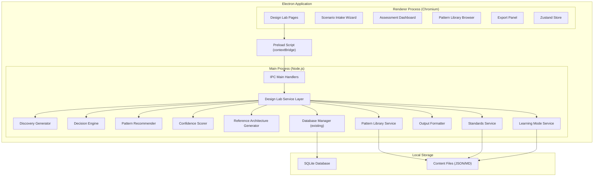
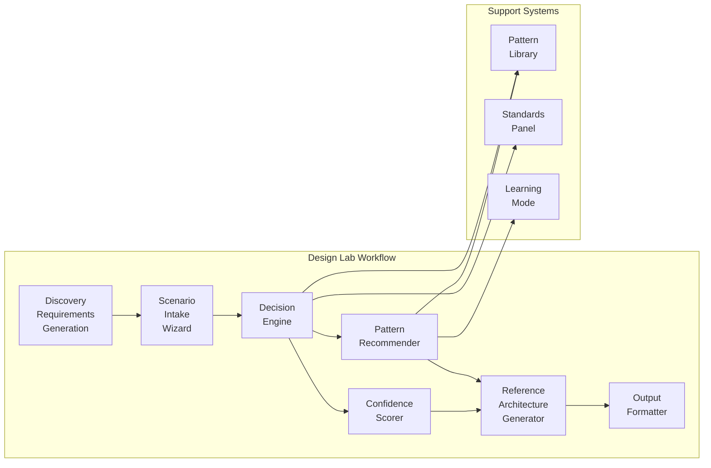
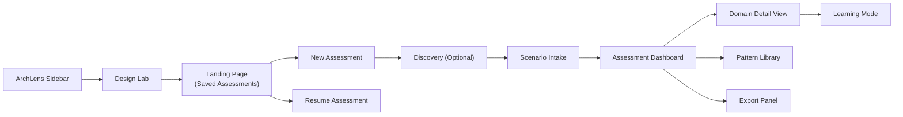

# Design Document — Architecture Design Lab

## Overview

The Architecture Design Lab is a new major module for ArchLens that guides UK government solution architects through a structured decision-making process, moving from requirements, constraints, and non-functional requirements into practical technical architecture decisions. Rather than blindly recommending technologies, the module explains why particular design patterns, cloud services, resilience models, and security controls may or may not be appropriate for a given workload.

The module covers the full journey from discovery requirements generation through scenario intake, decision engine assessment, pattern recommendation, confidence scoring (RAG status), reference architecture generation, learning mode, a searchable pattern library, standards alignment, and exportable output formats.

### Key Design Decisions

| Decision | Choice | Rationale |
|---|---|---|
| Assessment Engine | Local rule-based engine with structured content | Deterministic, reproducible outputs; no AI API dependency for core logic; works offline |
| Data Storage | SQLite (existing `better-sqlite3` instance) | Consistent with ArchLens data layer; structured relational data suits scenarios and assessments |
| Pattern Library | JSON content files in `resources/content/design-lab/` | Bundled with app; easy to update; follows existing content pattern |
| State Management | Zustand store (`design-lab-store.ts`) | Consistent with existing ArchLens stores; handles wizard state, assessment results |
| Wizard Navigation | Multi-step form with local state persistence | Allows save/resume; validates per-step; familiar UX pattern |
| Confidence Scoring | Rule-based RAG assignment per domain | Transparent logic; user can understand why a score was given |
| Export Format | Structured text (Markdown) with clipboard copy | No external dependencies; universal format; matches governance document workflows |
| Cloud Platform Filtering | Scenario-driven constraint propagation | Recommendations filtered to user's available platforms from intake |


## Architecture

### High-Level Architecture



### Module Internal Architecture



### Navigation Integration



### Process Architecture

The Design Lab follows the existing ArchLens two-process model:

**Main Process** — All assessment logic runs here:
- Discovery requirements generation (rule-based analysis of premise text)
- Decision engine assessment (pattern matching against scenario inputs)
- Confidence scoring (rule-based RAG assignment)
- Pattern library queries (JSON content file reads)
- Reference architecture generation (template-based document assembly)
- Output formatting (Markdown generation)
- SQLite persistence (scenarios, assessments, saved states)

**Renderer Process** — All UI runs here:
- Multi-step scenario intake wizard
- Assessment dashboard with RAG indicators
- Pattern library browser with search/filter
- Standards alignment checklist
- Export panel with clipboard integration
- Zustand store for local UI state and wizard progress

**Preload Script** — Extends the existing `window.archlens` API:
- Adds `designLab` namespace to the existing `ArchLensAPI` interface
- All IPC calls explicitly whitelisted in preload


## Components and Interfaces

### 1. Discovery Generator (`src/main/services/design-lab/discovery-generator.ts`)

Accepts a free-text solution premise and produces structured functional and non-functional requirements suitable for discovery sessions.

```typescript
interface SolutionPremise {
  description: string;
  additionalContext?: string;
}

interface DiscoveryRequirement {
  id: string;
  category: FunctionalCategory | NonFunctionalCategory;
  type: 'functional' | 'non-functional';
  description: string;
  rationale: string;
  discoveryQuestions: string[];
  isAmbiguous: boolean;
  ambiguityNote?: string;
}

type FunctionalCategory =
  | 'user-interactions'
  | 'data-processing'
  | 'integrations'
  | 'business-rules';

type NonFunctionalCategory =
  | 'performance'
  | 'security'
  | 'availability'
  | 'scalability'
  | 'usability'
  | 'maintainability'
  | 'compliance'
  | 'operability';

interface DiscoveryOutput {
  premiseId: string;
  premise: string;
  functionalRequirements: DiscoveryRequirement[];
  nonFunctionalRequirements: DiscoveryRequirement[];
  discoveryQuestions: string[];
  generatedAt: Date;
}

interface DiscoveryGenerator {
  analyse(premise: SolutionPremise): DiscoveryOutput;
  updateRequirement(outputId: string, reqId: string, updated: Partial<DiscoveryRequirement>): DiscoveryOutput;
  removeRequirement(outputId: string, reqId: string): DiscoveryOutput;
  addRequirement(outputId: string, req: Omit<DiscoveryRequirement, 'id'>): DiscoveryOutput;
  exportForDiscoveryPack(output: DiscoveryOutput): string;
  toScenarioIntakePreFill(output: DiscoveryOutput): Partial<ScenarioIntake>;
}
```

### 2. Scenario Intake Wizard (`src/main/services/design-lab/scenario-intake.ts`)

Captures the full workload context through a structured multi-step form. Validates inputs and supports save/resume.

```typescript
interface ScenarioIntake {
  id: string;
  name: string;
  createdAt: Date;
  updatedAt: Date;
  status: 'draft' | 'complete';
  steps: {
    cloudPlatforms: CloudPlatformStep;
    serviceType: ServiceTypeStep;
    userBase: UserBaseStep;
    trafficProfile: TrafficProfileStep;
    dataSensitivity: DataSensitivityStep;
    availability: AvailabilityStep;
    recovery: RecoveryStep;
    integrations: IntegrationStep;
    deployment: DeploymentStep;
    teamCapability: TeamCapabilityStep;
    constraints: ConstraintsStep;
    nfrs: NFRStep;
  };
}

interface CloudPlatformStep {
  availablePlatforms: Array<'aws' | 'azure' | 'gcp'>;
  noCloudAvailable: boolean;
  notes?: string;
}

interface ServiceTypeStep {
  type: 'public-facing' | 'internal' | 'api-service' | 'batch-processing'
    | 'data-platform' | 'integration-layer' | 'other';
  description: string;
}

interface UserBaseStep {
  expectedUsers: 'under-100' | '100-1000' | '1000-10000' | '10000-100000' | 'over-100000';
  userTypes: string[];
  peakUsagePattern?: string;
}

interface TrafficProfileStep {
  pattern: 'steady' | 'spiky' | 'seasonal' | 'growing' | 'unpredictable';
  peakDescription?: string;
  estimatedRequestsPerSecond?: number;
}

interface DataSensitivityStep {
  classification: 'official' | 'official-sensitive' | 'secret' | 'top-secret';
  containsPII: boolean;
  containsSpecialCategory: boolean;
  retentionRequirements?: string;
}

interface AvailabilityStep {
  targetAvailability: '99' | '99.5' | '99.9' | '99.95' | '99.99';
  maintenanceWindow: boolean;
  maintenanceWindowDetails?: string;
}

interface RecoveryStep {
  rto: string; // e.g., "4 hours", "1 hour", "15 minutes"
  rpo: string; // e.g., "24 hours", "1 hour", "zero"
  drStrategy?: 'active-active' | 'active-passive' | 'pilot-light' | 'backup-restore';
}

interface IntegrationStep {
  systems: IntegrationTarget[];
  protocols: Array<'rest-api' | 'soap' | 'messaging' | 'file-transfer' | 'database' | 'event-stream'>;
}

interface IntegrationTarget {
  name: string;
  type: 'internal' | 'external' | 'third-party';
  protocol: string;
  dataFlow: 'inbound' | 'outbound' | 'bidirectional';
}

interface DeploymentStep {
  preference: 'cloud-native' | 'containerised' | 'vm-based' | 'serverless' | 'hybrid' | 'no-preference';
  existingInfrastructure?: string;
  cicdRequirements?: string;
}

interface TeamCapabilityStep {
  teamSize: 'solo' | 'small-2-5' | 'medium-6-15' | 'large-16-plus';
  cloudExperience: 'none' | 'basic' | 'intermediate' | 'advanced';
  relevantSkills: string[];
  constraints?: string;
}

interface ConstraintsStep {
  budgetConstraints?: string;
  timelineConstraints?: string;
  technologyConstraints?: string[];
  organisationalConstraints?: string[];
  regulatoryConstraints?: string[];
}

interface NFRStep {
  performanceRequirements?: string;
  securityRequirements?: string;
  complianceRequirements?: string;
  accessibilityRequirements?: string;
  otherRequirements?: string;
}

interface WizardValidation {
  stepId: string;
  isValid: boolean;
  errors: Array<{ field: string; message: string }>;
}

interface ScenarioIntakeService {
  createScenario(name: string): ScenarioIntake;
  saveStep(scenarioId: string, stepId: string, data: unknown): WizardValidation;
  getScenario(scenarioId: string): ScenarioIntake;
  listScenarios(): ScenarioIntake[];
  deleteScenario(scenarioId: string): void;
  validateScenario(scenarioId: string): WizardValidation[];
  getSummary(scenarioId: string): ScenarioSummary;
}

interface ScenarioSummary {
  scenarioId: string;
  name: string;
  cloudPlatforms: string[];
  serviceType: string;
  dataClassification: string;
  availability: string;
  completeness: number; // 0-100 percentage
  missingFields: string[];
}
```

### 3. Decision Engine (`src/main/services/design-lab/decision-engine.ts`)

Analyses scenario intake data and generates structured assessments across all architecture domains.

```typescript
type ArchitectureDomain =
  | 'hosting-compute'
  | 'data-persistence'
  | 'integration-apis'
  | 'networking-edge'
  | 'identity-access'
  | 'security-controls'
  | 'resilience-dr'
  | 'observability-operations'
  | 'deployment-release'
  | 'cost-sustainability'
  | 'compliance-assurance';

interface DomainAssessment {
  domain: ArchitectureDomain;
  recommendedPattern: string;
  candidateTechnologies: CandidateTechnology[];
  rationale: string;
  alternativesRationale: string;
  risksAndAssumptions: RiskAssumption[];
  questionsToAskNext: string[];
  evidenceNeeded: string[];
  artefactsToProduce: string[];
  relevantStandards: string[];
  operationalBurden: OperationalBurden;
  costConsiderations: CostConsideration;
  viableOptions: ViableOption[];
  labels: AssessmentLabels;
}

interface CandidateTechnology {
  name: string;
  category: string;
  platform: 'aws' | 'azure' | 'gcp' | 'on-premises' | 'saas' | 'multi-cloud';
  isRecommended: boolean;
  rationale: string;
}

interface RiskAssumption {
  type: 'risk' | 'assumption';
  description: string;
  severity: 'high' | 'medium' | 'low';
  mitigation?: string;
}

interface OperationalBurden {
  staffingImplications: string;
  skillsRequired: string[];
  toolingRequired: string[];
  ongoingMaintenance: string;
  complexity: 'low' | 'medium' | 'high';
}

interface CostConsideration {
  runningCosts: string;
  transitionCosts: string;
  costDrivers: string[];
  optimisationOpportunities: string[];
}

interface ViableOption {
  name: string;
  description: string;
  tradeOffs: { advantage: string; disadvantage: string }[];
  suitabilityScore: number; // 0-100
}

interface AssessmentLabels {
  facts: string[];
  assumptions: string[];
  recommendations: string[];
}

interface MissingInformation {
  domain: ArchitectureDomain;
  missingFields: string[];
  impact: string;
  question: string;
}

interface AssessmentResult {
  id: string;
  scenarioId: string;
  domains: DomainAssessment[];
  missingInformation: MissingInformation[];
  generatedAt: Date;
}

interface DecisionEngine {
  assess(scenario: ScenarioIntake): AssessmentResult;
  reassess(scenarioId: string, updatedScenario: ScenarioIntake): AssessmentResult;
  getDomainAssessment(assessmentId: string, domain: ArchitectureDomain): DomainAssessment;
  getMissingInformation(assessmentId: string): MissingInformation[];
}
```

### 4. Confidence Scorer (`src/main/services/design-lab/confidence-scorer.ts`)

Assigns RAG status to each architecture domain based on assessment completeness and strength.

```typescript
type RAGStatus = 'green' | 'amber' | 'red' | 'grey' | 'na';

interface ConfidenceScore {
  domain: ArchitectureDomain;
  status: RAGStatus;
  rationale: string;
  gaps: string[];
  improvementActions: string[];
}

interface ConfidenceSummary {
  assessmentId: string;
  scores: ConfidenceScore[];
  overallMaturity: 'early' | 'developing' | 'established' | 'mature';
  greenCount: number;
  amberCount: number;
  redCount: number;
  greyCount: number;
  naCount: number;
}

interface ConfidenceScorer {
  score(assessment: AssessmentResult, scenario: ScenarioIntake): ConfidenceSummary;
  getScore(assessmentId: string, domain: ArchitectureDomain): ConfidenceScore;
  getSummary(assessmentId: string): ConfidenceSummary;
}
```

### 5. Pattern Recommender (`src/main/services/design-lab/pattern-recommender.ts`)

Produces consolidated recommendations with decision logic explained.

```typescript
interface PatternRecommendation {
  domain: ArchitectureDomain;
  patternName: string;
  patternId: string;
  decisionLogic: string;
  conditionsForChange: string[];
  risks: RiskAssumption[];
  confidenceLevel: RAGStatus;
}

interface ConsolidatedRecommendation {
  assessmentId: string;
  recommendations: PatternRecommendation[];
  crossCuttingConcerns: string[];
  generatedAt: Date;
}

interface PatternRecommender {
  recommend(assessment: AssessmentResult): ConsolidatedRecommendation;
  getRecommendation(assessmentId: string, domain: ArchitectureDomain): PatternRecommendation;
}
```

### 6. Reference Architecture Generator (`src/main/services/design-lab/reference-architecture-generator.ts`)

Produces high-level architecture summaries from assessment results.

```typescript
interface ReferenceArchitecture {
  id: string;
  assessmentId: string;
  designSummary: string; // Plain English
  keyComponents: ComponentEntry[];
  dataFlowDescription: string;
  securityControls: string[];
  resilienceModel: string;
  operationalModel: string;
  integrationApproach: string;
  deploymentApproach: string;
  keyRisks: RiskAssumption[];
  openQuestions: CategorisedQuestion[];
  assumptions: string[];
  adrCandidates: ADRCandidate[];
  hldSectionDraft: string;
  governanceReviewQuestions: string[];
  generatedAt: Date;
}

interface ComponentEntry {
  name: string;
  purpose: string;
  technology: string;
  platform: string;
}

interface CategorisedQuestion {
  question: string;
  stakeholderGroup: 'technical' | 'security' | 'operations' | 'delivery' | 'finance' | 'governance';
}

interface ADRCandidate {
  title: string;
  contextStatement: string;
  domain: ArchitectureDomain;
}

interface ReferenceArchitectureGenerator {
  generate(assessment: AssessmentResult, recommendation: ConsolidatedRecommendation): ReferenceArchitecture;
  regenerate(assessmentId: string): ReferenceArchitecture;
}
```

### 7. Pattern Library Service (`src/main/services/design-lab/pattern-library.ts`)

Manages the searchable library of architecture patterns.

```typescript
interface PatternEntry {
  id: string;
  name: string;
  description: string;
  whenToUse: string[];
  whenNotToUse: string[];
  typicalComponents: ComponentEntry[];
  securityControls: string[];
  resilienceConsiderations: string[];
  costConsiderations: string[];
  operationalConsiderations: string[];
  cloudServiceExamples: CloudServiceExample[];
  questionsToAsk: string[];
  commonMistakes: string[];
  workloadTypes: string[];
  securityClassifications: string[];
}

interface CloudServiceExample {
  platform: 'aws' | 'azure' | 'gcp';
  services: Array<{ name: string; purpose: string }>;
}

interface PatternSearchResult {
  pattern: PatternEntry;
  relevanceScore: number;
  matchedOn: string[];
}

interface PatternFilter {
  cloudProvider?: 'aws' | 'azure' | 'gcp';
  workloadType?: string;
  securityClassification?: string;
}

interface PatternLibraryService {
  search(query: string, filter?: PatternFilter): PatternSearchResult[];
  getPattern(id: string): PatternEntry;
  getAllPatterns(): PatternEntry[];
  getPatternsByFilter(filter: PatternFilter): PatternEntry[];
  getSuggestions(query: string): PatternEntry[];
  highlightForPlatforms(patternId: string, platforms: string[]): PatternEntry;
}
```

### 8. Standards Service (`src/main/services/design-lab/standards-service.ts`)

Manages the standards alignment checklist and tracks user review status.

```typescript
interface Standard {
  id: string;
  name: string;
  category: 'government-policy' | 'security' | 'cloud' | 'accessibility' | 'departmental';
  description: string;
  url?: string;
  applicableDomains: ArchitectureDomain[];
}

interface StandardReviewStatus {
  standardId: string;
  assessmentId: string;
  status: 'not-reviewed' | 'reviewed' | 'not-applicable' | 'action-required';
  note?: string;
  reviewedAt?: Date;
}

interface StandardsService {
  getApplicableStandards(domains: ArchitectureDomain[]): Standard[];
  getAllStandards(): Standard[];
  getRelevantForDomain(domain: ArchitectureDomain): Standard[];
  setReviewStatus(assessmentId: string, standardId: string, status: StandardReviewStatus['status'], note?: string): void;
  getReviewStatuses(assessmentId: string): StandardReviewStatus[];
}
```

### 9. Output Formatter (`src/main/services/design-lab/output-formatter.ts`)

Generates exportable architecture documents in structured text format.

```typescript
type OutputType =
  | 'architecture-decision-summary'
  | 'hld-section'
  | 'adr-draft'
  | 'governance-briefing'
  | 'risk-assumption-log'
  | 'pattern-comparison'
  | 'stakeholder-questions';

interface FormattedOutput {
  type: OutputType;
  title: string;
  content: string; // Markdown formatted
  generatedAt: Date;
  assessmentId: string;
}

interface ADROutput extends FormattedOutput {
  type: 'adr-draft';
  sections: {
    title: string;
    status: string;
    context: string;
    decision: string;
    consequences: string;
  };
}

interface GovernanceBriefingOutput extends FormattedOutput {
  type: 'governance-briefing';
  sections: {
    executiveSummary: string;
    keyDecisions: string;
    risks: string;
    assumptions: string;
    openQuestions: string;
  };
}

interface OutputFormatter {
  generate(assessmentId: string, type: OutputType): FormattedOutput;
  generateAll(assessmentId: string): FormattedOutput[];
  copyToClipboard(content: string): void;
}
```

### 10. Learning Mode Service (`src/main/services/design-lab/learning-mode.ts`)

Provides educational context for architecture decisions.

```typescript
interface LearningContent {
  domain: ArchitectureDomain;
  patternName: string;
  whySelected: string;
  whenInappropriate: string[];
  architectQuestions: string[];
  antiPatterns: AntiPattern[];
  stakeholderChallenges: StakeholderChallenge[];
  governanceExpectations: string[];
}

interface AntiPattern {
  name: string;
  description: string;
  whyProblematic: string;
  betterApproach: string;
}

interface StakeholderChallenge {
  stakeholder: 'security' | 'operations' | 'delivery' | 'finance';
  typicalChallenges: string[];
}

interface LearningModeService {
  getContent(domain: ArchitectureDomain, patternName: string): LearningContent;
  getAntiPatterns(domain: ArchitectureDomain): AntiPattern[];
  getGovernanceExpectations(domain: ArchitectureDomain): string[];
}
```

### 11. IPC Bridge Extension (`src/preload/index.ts` — additions)

Extends the existing `window.archlens` API with the Design Lab namespace.

```typescript
// Added to existing ArchLensAPI interface
interface ArchLensAPI {
  // ... existing namespaces ...
  designLab: {
    // Discovery
    analyseDiscovery(premise: SolutionPremise): Promise<DiscoveryOutput>;
    updateDiscoveryRequirement(outputId: string, reqId: string, updated: Partial<DiscoveryRequirement>): Promise<DiscoveryOutput>;
    removeDiscoveryRequirement(outputId: string, reqId: string): Promise<DiscoveryOutput>;
    addDiscoveryRequirement(outputId: string, req: Omit<DiscoveryRequirement, 'id'>): Promise<DiscoveryOutput>;
    exportDiscoveryPack(outputId: string): Promise<string>;

    // Scenario Intake
    createScenario(name: string): Promise<ScenarioIntake>;
    saveScenarioStep(scenarioId: string, stepId: string, data: unknown): Promise<WizardValidation>;
    getScenario(scenarioId: string): Promise<ScenarioIntake>;
    listScenarios(): Promise<ScenarioIntake[]>;
    deleteScenario(scenarioId: string): Promise<void>;
    getScenarioSummary(scenarioId: string): Promise<ScenarioSummary>;

    // Assessment
    runAssessment(scenarioId: string): Promise<AssessmentResult>;
    getAssessment(assessmentId: string): Promise<AssessmentResult>;
    getDomainAssessment(assessmentId: string, domain: ArchitectureDomain): Promise<DomainAssessment>;

    // Confidence
    getConfidenceSummary(assessmentId: string): Promise<ConfidenceSummary>;

    // Recommendations
    getRecommendations(assessmentId: string): Promise<ConsolidatedRecommendation>;

    // Reference Architecture
    generateReferenceArchitecture(assessmentId: string): Promise<ReferenceArchitecture>;

    // Pattern Library
    searchPatterns(query: string, filter?: PatternFilter): Promise<PatternSearchResult[]>;
    getPattern(id: string): Promise<PatternEntry>;
    getAllPatterns(): Promise<PatternEntry[]>;

    // Standards
    getApplicableStandards(assessmentId: string): Promise<Standard[]>;
    setStandardReviewStatus(assessmentId: string, standardId: string, status: string, note?: string): Promise<void>;
    getStandardReviewStatuses(assessmentId: string): Promise<StandardReviewStatus[]>;

    // Output
    generateOutput(assessmentId: string, type: OutputType): Promise<FormattedOutput>;
    copyToClipboard(content: string): Promise<void>;

    // Learning Mode
    getLearningContent(domain: ArchitectureDomain, patternName: string): Promise<LearningContent>;

    // Saved Assessments
    listSavedAssessments(): Promise<SavedAssessment[]>;
  };
}

interface SavedAssessment {
  id: string;
  scenarioId: string;
  name: string;
  createdAt: Date;
  updatedAt: Date;
  status: 'in-progress' | 'complete';
  confidenceSummary?: ConfidenceSummary;
}
```

### 12. Zustand Store (`src/renderer/stores/design-lab-store.ts`)

Manages client-side state for the Design Lab UI.

```typescript
interface DesignLabState {
  // Wizard state
  currentScenarioId: string | null;
  currentStep: number;
  wizardData: Partial<ScenarioIntake>;
  validationErrors: Record<string, string[]>;

  // Assessment state
  currentAssessmentId: string | null;
  assessmentResult: AssessmentResult | null;
  confidenceSummary: ConfidenceSummary | null;
  recommendations: ConsolidatedRecommendation | null;

  // UI state
  selectedDomain: ArchitectureDomain | null;
  activeTab: 'assessment' | 'patterns' | 'standards' | 'export' | 'learning';
  isLoading: boolean;
  error: string | null;

  // Pattern library state
  patternSearchQuery: string;
  patternFilter: PatternFilter;
  patternResults: PatternSearchResult[];

  // Standards state
  standardReviewStatuses: StandardReviewStatus[];

  // Actions
  setCurrentStep: (step: number) => void;
  updateWizardData: (stepId: string, data: unknown) => void;
  setAssessmentResult: (result: AssessmentResult) => void;
  setConfidenceSummary: (summary: ConfidenceSummary) => void;
  setRecommendations: (recs: ConsolidatedRecommendation) => void;
  selectDomain: (domain: ArchitectureDomain | null) => void;
  setActiveTab: (tab: DesignLabState['activeTab']) => void;
  setLoading: (loading: boolean) => void;
  setError: (error: string | null) => void;
  reset: () => void;
}
```


## Data Models

### SQLite Database Schema Additions

The following tables are added to the existing ArchLens SQLite database.

```sql
-- Design Lab scenarios (intake wizard data)
CREATE TABLE design_lab_scenarios (
    id TEXT PRIMARY KEY,
    name TEXT NOT NULL,
    status TEXT NOT NULL CHECK (status IN ('draft', 'complete')) DEFAULT 'draft',
    steps_json TEXT NOT NULL DEFAULT '{}', -- JSON blob of all wizard step data
    completeness INTEGER NOT NULL DEFAULT 0, -- 0-100 percentage
    created_at TEXT NOT NULL DEFAULT (datetime('now')),
    updated_at TEXT NOT NULL DEFAULT (datetime('now'))
);

-- Design Lab assessments (decision engine output)
CREATE TABLE design_lab_assessments (
    id TEXT PRIMARY KEY,
    scenario_id TEXT NOT NULL REFERENCES design_lab_scenarios(id) ON DELETE CASCADE,
    result_json TEXT NOT NULL, -- JSON blob of AssessmentResult
    status TEXT NOT NULL CHECK (status IN ('in-progress', 'complete')) DEFAULT 'in-progress',
    created_at TEXT NOT NULL DEFAULT (datetime('now')),
    updated_at TEXT NOT NULL DEFAULT (datetime('now'))
);

-- Confidence scores per assessment
CREATE TABLE design_lab_confidence (
    id TEXT PRIMARY KEY,
    assessment_id TEXT NOT NULL REFERENCES design_lab_assessments(id) ON DELETE CASCADE,
    domain TEXT NOT NULL,
    status TEXT NOT NULL CHECK (status IN ('green', 'amber', 'red', 'grey', 'na')),
    rationale TEXT NOT NULL,
    gaps_json TEXT NOT NULL DEFAULT '[]',
    improvement_actions_json TEXT NOT NULL DEFAULT '[]',
    scored_at TEXT NOT NULL DEFAULT (datetime('now')),
    UNIQUE(assessment_id, domain)
);

-- Standards review tracking
CREATE TABLE design_lab_standard_reviews (
    id TEXT PRIMARY KEY,
    assessment_id TEXT NOT NULL REFERENCES design_lab_assessments(id) ON DELETE CASCADE,
    standard_id TEXT NOT NULL,
    status TEXT NOT NULL CHECK (status IN ('not-reviewed', 'reviewed', 'not-applicable', 'action-required')),
    note TEXT,
    reviewed_at TEXT,
    UNIQUE(assessment_id, standard_id)
);

-- Discovery outputs
CREATE TABLE design_lab_discoveries (
    id TEXT PRIMARY KEY,
    premise TEXT NOT NULL,
    output_json TEXT NOT NULL, -- JSON blob of DiscoveryOutput
    created_at TEXT NOT NULL DEFAULT (datetime('now')),
    updated_at TEXT NOT NULL DEFAULT (datetime('now'))
);

-- Reference architecture outputs
CREATE TABLE design_lab_reference_architectures (
    id TEXT PRIMARY KEY,
    assessment_id TEXT NOT NULL REFERENCES design_lab_assessments(id) ON DELETE CASCADE,
    content_json TEXT NOT NULL, -- JSON blob of ReferenceArchitecture
    generated_at TEXT NOT NULL DEFAULT (datetime('now'))
);

-- Generated output documents
CREATE TABLE design_lab_outputs (
    id TEXT PRIMARY KEY,
    assessment_id TEXT NOT NULL REFERENCES design_lab_assessments(id) ON DELETE CASCADE,
    output_type TEXT NOT NULL,
    title TEXT NOT NULL,
    content TEXT NOT NULL, -- Markdown formatted
    generated_at TEXT NOT NULL DEFAULT (datetime('now'))
);
```

### Content File Structure

Pattern library and standards content is bundled with the application:

```
resources/
├── content/
│   ├── design-lab/
│   │   ├── patterns/                    # Architecture pattern definitions
│   │   │   ├── static-website.json
│   │   │   ├── public-transactional.json
│   │   │   ├── internal-lob.json
│   │   │   ├── api-led-integration.json
│   │   │   ├── event-driven.json
│   │   │   ├── batch-file-transfer.json
│   │   │   ├── data-lake-analytics.json
│   │   │   ├── saas-first.json
│   │   │   ├── containerised.json
│   │   │   ├── serverless.json
│   │   │   ├── vm-legacy.json
│   │   │   ├── multi-az-production.json
│   │   │   ├── multi-region-dr.json
│   │   │   ├── edge-protected-public.json
│   │   │   ├── secure-admin-portal.json
│   │   │   ├── case-management.json
│   │   │   ├── document-upload-processing.json
│   │   │   └── hybrid-cloud.json
│   │   ├── standards/                   # Standards definitions
│   │   │   ├── tcop.json
│   │   │   ├── cloud-first.json
│   │   │   ├── govuk-service-standard.json
│   │   │   ├── secure-by-design.json
│   │   │   ├── ncsc-cloud-security.json
│   │   │   ├── data-protection.json
│   │   │   ├── accessibility.json
│   │   │   ├── aws-well-architected.json
│   │   │   ├── azure-well-architected.json
│   │   │   └── departmental-principles.json
│   │   ├── learning/                    # Learning mode content
│   │   │   ├── anti-patterns/
│   │   │   │   ├── hosting-compute.json
│   │   │   │   ├── data-persistence.json
│   │   │   │   └── ... (one per domain)
│   │   │   ├── governance-expectations/
│   │   │   │   └── ... (one per domain)
│   │   │   └── stakeholder-challenges/
│   │   │       └── ... (one per domain)
│   │   ├── decision-rules/              # Decision engine rule sets
│   │   │   ├── hosting-compute.json
│   │   │   ├── data-persistence.json
│   │   │   ├── integration-apis.json
│   │   │   ├── networking-edge.json
│   │   │   ├── identity-access.json
│   │   │   ├── security-controls.json
│   │   │   ├── resilience-dr.json
│   │   │   ├── observability-operations.json
│   │   │   ├── deployment-release.json
│   │   │   ├── cost-sustainability.json
│   │   │   └── compliance-assurance.json
│   │   └── templates/                   # Output format templates
│   │       ├── adr-template.md
│   │       ├── governance-briefing-template.md
│   │       ├── hld-section-template.md
│   │       └── risk-log-template.md
```

### Pattern File Schema Example

```json
{
  "id": "public-transactional",
  "name": "Public-Facing Transactional Service",
  "description": "A citizen-facing digital service that processes transactions, stores data, and integrates with back-office systems.",
  "whenToUse": [
    "Building a GOV.UK service that citizens interact with directly",
    "Service involves form submissions, payments, or case tracking",
    "Needs to meet GDS Service Standard assessment"
  ],
  "whenNotToUse": [
    "Internal-only tool with no public access",
    "Static informational content with no transactions",
    "Batch processing with no real-time user interaction"
  ],
  "typicalComponents": [
    { "name": "CDN / WAF", "purpose": "Edge protection and DDoS mitigation" },
    { "name": "Load Balancer", "purpose": "Traffic distribution and SSL termination" },
    { "name": "Application Tier", "purpose": "Business logic and request handling" },
    { "name": "Database", "purpose": "Transactional data persistence" },
    { "name": "Cache Layer", "purpose": "Session and response caching" },
    { "name": "Message Queue", "purpose": "Async processing and integration" }
  ],
  "securityControls": [
    "WAF with OWASP rule set",
    "TLS 1.2+ everywhere",
    "Input validation and output encoding",
    "Rate limiting per IP and per user",
    "CSRF protection",
    "Security headers (CSP, HSTS, X-Frame-Options)"
  ],
  "resilienceConsiderations": [
    "Multi-AZ deployment for all stateful components",
    "Auto-scaling based on request rate",
    "Circuit breaker for downstream integrations",
    "Graceful degradation when dependencies fail"
  ],
  "costConsiderations": [
    "Compute costs scale with traffic",
    "Database costs driven by storage and IOPS",
    "CDN costs driven by bandwidth",
    "Consider reserved capacity for predictable baseline"
  ],
  "operationalConsiderations": [
    "24/7 monitoring required for public services",
    "Incident response process needed",
    "Regular patching and vulnerability scanning",
    "Performance testing before go-live"
  ],
  "cloudServiceExamples": [
    {
      "platform": "aws",
      "services": [
        { "name": "CloudFront + WAF", "purpose": "CDN and edge protection" },
        { "name": "ALB", "purpose": "Load balancing" },
        { "name": "ECS Fargate", "purpose": "Container hosting" },
        { "name": "RDS PostgreSQL", "purpose": "Database" },
        { "name": "ElastiCache", "purpose": "Caching" },
        { "name": "SQS", "purpose": "Message queue" }
      ]
    },
    {
      "platform": "azure",
      "services": [
        { "name": "Front Door + WAF", "purpose": "CDN and edge protection" },
        { "name": "App Gateway", "purpose": "Load balancing" },
        { "name": "App Service", "purpose": "Application hosting" },
        { "name": "Azure SQL", "purpose": "Database" },
        { "name": "Redis Cache", "purpose": "Caching" },
        { "name": "Service Bus", "purpose": "Message queue" }
      ]
    }
  ],
  "questionsToAsk": [
    "What is the expected peak concurrent user count?",
    "What data classification applies to the data being processed?",
    "Are there existing integration points with back-office systems?",
    "What is the acceptable response time for user-facing requests?"
  ],
  "commonMistakes": [
    "Not implementing rate limiting from day one",
    "Storing session state in the application tier",
    "Not planning for zero-downtime deployments",
    "Ignoring accessibility requirements until late in delivery"
  ],
  "workloadTypes": ["public-facing", "transactional", "citizen-service"],
  "securityClassifications": ["official", "official-sensitive"]
}
```


## Correctness Properties

*A property is a characteristic or behavior that should hold true across all valid executions of a system — essentially, a formal statement about what the system should do. Properties serve as the bridge between human-readable specifications and machine-verifiable correctness guarantees.*

### Property 1: Discovery output contains both functional and non-functional requirements with valid categories

*For any* non-empty solution premise string, calling `analyse()` should produce a DiscoveryOutput where every functional requirement has a category from the valid FunctionalCategory set (`user-interactions`, `data-processing`, `integrations`, `business-rules`) and every non-functional requirement has a category from the valid NonFunctionalCategory set (`performance`, `security`, `availability`, `scalability`, `usability`, `maintainability`, `compliance`, `operability`).

**Validates: Requirements 1.1, 1.2, 1.3, 1.6**

### Property 2: Discovery requirements have sufficient detail

*For any* DiscoveryOutput produced by the Discovery_Generator, every requirement (functional and non-functional) should have a non-empty `description` field with at least 20 characters and a non-empty `rationale` field.

**Validates: Requirements 1.4**

### Property 3: Ambiguous requirements are flagged with explanatory notes

*For any* DiscoveryRequirement in a DiscoveryOutput where `isAmbiguous` is `true`, the `ambiguityNote` field should be a non-empty string, and the `discoveryQuestions` array should contain at least one entry.

**Validates: Requirements 1.5**

### Property 4: Discovery requirement CRUD round-trip

*For any* valid DiscoveryOutput and a new requirement with valid fields, calling `addRequirement` should produce an output containing that requirement, calling `removeRequirement` with its ID should produce an output without it, and calling `updateRequirement` with modified fields should produce an output reflecting those changes.

**Validates: Requirements 1.7**

### Property 5: Discovery export contains all requirement descriptions

*For any* DiscoveryOutput with at least one requirement, calling `exportForDiscoveryPack` should produce a non-empty string that contains the `description` text of every requirement in the output.

**Validates: Requirements 1.9**

### Property 6: Discovery to scenario intake pre-fill produces valid partial scenario

*For any* DiscoveryOutput, calling `toScenarioIntakePreFill` should produce a partial ScenarioIntake object where every populated field has a valid value according to its type definition.

**Validates: Requirements 1.8**

### Property 7: Scenario intake wizard validates mandatory fields

*For any* wizard step with one or more mandatory fields left empty, calling `saveStep` should return a WizardValidation with `isValid` set to `false` and a non-empty `errors` array where each error references the missing field name. For any step with all mandatory fields populated with valid values, validation should return `isValid` as `true` with an empty errors array.

**Validates: Requirements 2.3**

### Property 8: Scenario intake data persistence round-trip

*For any* scenario with random valid step data saved across multiple steps, calling `getScenario` with the same ID should return a ScenarioIntake where all previously saved step data matches the original values exactly.

**Validates: Requirements 2.4, 2.6**

### Property 9: Scenario summary reflects actual scenario data

*For any* ScenarioIntake with populated steps, calling `getSummary` should return a ScenarioSummary where `cloudPlatforms` matches the platforms in the CloudPlatformStep, `serviceType` matches the ServiceTypeStep type, and `dataClassification` matches the DataSensitivityStep classification.

**Validates: Requirements 2.5**

### Property 10: Decision engine produces assessments for all 11 architecture domains

*For any* complete ScenarioIntake (all mandatory fields populated), calling `assess()` should produce an AssessmentResult where the `domains` array contains exactly 11 entries, one for each ArchitectureDomain value, with no duplicates.

**Validates: Requirements 3.1**

### Property 11: Domain assessments have all required structural fields

*For any* DomainAssessment in an AssessmentResult, the following fields should all be non-empty: `recommendedPattern` (string), `candidateTechnologies` (array with ≥1 entry), `rationale` (string), `risksAndAssumptions` (array), `questionsToAskNext` (array with ≥1 entry), `relevantStandards` (array with ≥1 entry), and `artefactsToProduce` (array with ≥1 entry).

**Validates: Requirements 3.2**

### Property 12: Assessment outputs are labelled as facts, assumptions, or recommendations

*For any* DomainAssessment in an AssessmentResult, the `labels` object should have non-empty `facts`, `assumptions`, and `recommendations` arrays, and the union of all three arrays should cover all substantive claims in the assessment.

**Validates: Requirements 3.3, 11.2**

### Property 13: Viable options include comparative trade-offs

*For any* DomainAssessment where `viableOptions` has more than one entry, every ViableOption should have a non-empty `tradeOffs` array with at least one entry containing both a non-empty `advantage` and a non-empty `disadvantage`.

**Validates: Requirements 3.4, 11.3**

### Property 14: Operational burden and cost considerations are populated

*For any* DomainAssessment, the `operationalBurden` should have a non-empty `staffingImplications` string, a non-empty `skillsRequired` array, and a valid `complexity` value. The `costConsiderations` should have a non-empty `runningCosts` string and a non-empty `costDrivers` array.

**Validates: Requirements 3.5, 3.6, 11.4, 11.5**

### Property 15: Platform constraint propagation filters candidate technologies

*For any* ScenarioIntake where `cloudPlatforms.availablePlatforms` contains a specific subset of platforms and `noCloudAvailable` is false, every CandidateTechnology in every DomainAssessment should have a `platform` value that is either one of the selected platforms, `'saas'`, `'on-premises'`, or `'multi-cloud'`.

**Validates: Requirements 3.9**

### Property 16: No-cloud scenario excludes cloud-specific technologies

*For any* ScenarioIntake where `cloudPlatforms.noCloudAvailable` is `true`, no CandidateTechnology in any DomainAssessment should have a `platform` value of `'aws'`, `'azure'`, or `'gcp'`.

**Validates: Requirements 3.10**

### Property 17: Pattern recommendations cover all assessed domains with decision logic

*For any* AssessmentResult, calling `recommend()` should produce a ConsolidatedRecommendation where the `recommendations` array has one entry per domain in the assessment, and every PatternRecommendation has a non-empty `decisionLogic` string and a non-empty `conditionsForChange` array.

**Validates: Requirements 4.1, 4.2, 4.3**

### Property 18: High-severity risks in recommendations have mitigations

*For any* PatternRecommendation in a ConsolidatedRecommendation, every RiskAssumption with `severity` equal to `'high'` should have a non-empty `mitigation` string.

**Validates: Requirements 4.4, 11.6**

### Property 19: Confidence scores cover all domains with valid RAG status

*For any* AssessmentResult and ScenarioIntake, calling `score()` should produce a ConfidenceSummary where `scores` has exactly one entry per ArchitectureDomain, each with a valid RAGStatus value, and `greenCount + amberCount + redCount + greyCount + naCount` equals `scores.length`.

**Validates: Requirements 5.1, 5.7**

### Property 20: RAG status consistency with gaps

*For any* ConfidenceScore with status `'green'`, the `gaps` array should be empty. For any ConfidenceScore with status `'amber'` or `'red'`, the `gaps` array should be non-empty. For any ConfidenceScore with status `'red'`, the `gaps` array should have more entries than for `'amber'` scores in the same summary (when both exist).

**Validates: Requirements 5.2, 5.3, 5.4, 5.5, 5.6**

### Property 21: Reference architecture has all required sections populated

*For any* AssessmentResult and ConsolidatedRecommendation, calling `generate()` should produce a ReferenceArchitecture where `designSummary`, `dataFlowDescription`, `securityControls`, `resilienceModel`, `operationalModel`, `integrationApproach`, and `deploymentApproach` are all non-empty, and `keyComponents` has at least one entry.

**Validates: Requirements 6.1**

### Property 22: Open questions are categorised by valid stakeholder group

*For any* ReferenceArchitecture, every CategorisedQuestion in `openQuestions` should have a `stakeholderGroup` value from the valid set (`'technical'`, `'security'`, `'operations'`, `'delivery'`, `'finance'`, `'governance'`).

**Validates: Requirements 6.3**

### Property 23: ADR candidates have title and context statement

*For any* ReferenceArchitecture with at least one ADR candidate, every ADRCandidate should have a non-empty `title` and a non-empty `contextStatement`.

**Validates: Requirements 6.4**

### Property 24: Learning mode content has all required educational fields

*For any* valid ArchitectureDomain and pattern name combination, calling `getContent()` should return a LearningContent where `whySelected` is non-empty, `whenInappropriate` has at least one entry, `architectQuestions` has at least one entry, `antiPatterns` has at least one entry with non-empty `name`, `description`, `whyProblematic`, and `betterApproach` fields, `stakeholderChallenges` has at least one entry, and `governanceExpectations` has at least one entry.

**Validates: Requirements 7.1, 7.2, 7.3, 7.4, 7.5, 7.6**

### Property 25: Pattern library entries have all required display fields

*For any* PatternEntry returned by the Pattern Library, the following arrays should all be non-empty: `whenToUse`, `whenNotToUse`, `typicalComponents`, `securityControls`, `resilienceConsiderations`, `costConsiderations`, `operationalConsiderations`, `cloudServiceExamples`, `questionsToAsk`, and `commonMistakes`.

**Validates: Requirements 8.2**

### Property 26: Pattern search returns results matching the query

*For any* PatternEntry in the library, searching by the pattern's exact `name` should return a PatternSearchResult array containing that pattern with a positive `relevanceScore`.

**Validates: Requirements 8.3**

### Property 27: Pattern filter returns only matching patterns

*For any* PatternFilter with a `cloudProvider` set, all PatternEntry results returned by `getPatternsByFilter` should have at least one CloudServiceExample with a matching `platform` value.

**Validates: Requirements 8.5**

### Property 28: Standards relevance filtering returns only applicable standards

*For any* ArchitectureDomain, all Standard objects returned by `getRelevantForDomain` should have that domain present in their `applicableDomains` array.

**Validates: Requirements 9.1, 9.2**

### Property 29: Standards review status round-trip

*For any* valid assessment ID, standard ID, status value, and optional note string, calling `setReviewStatus` followed by `getReviewStatuses` should return a StandardReviewStatus with matching `standardId`, `status`, and `note` values.

**Validates: Requirements 9.3, 9.4**

### Property 30: Output formatter produces valid non-empty content for all output types

*For any* valid OutputType value and a valid assessment ID with existing assessment data, calling `generate()` should return a FormattedOutput with a non-empty `content` string, a non-empty `title`, and a `type` matching the requested output type.

**Validates: Requirements 10.1, 10.2**

### Property 31: ADR output has all required template sections

*For any* ADROutput generated by the Output_Formatter, the `sections` object should have non-empty `title`, `status`, `context`, `decision`, and `consequences` fields.

**Validates: Requirements 10.3**

### Property 32: Governance briefing output has all required sections

*For any* GovernanceBriefingOutput generated by the Output_Formatter, the `sections` object should have non-empty `executiveSummary`, `keyDecisions`, `risks`, `assumptions`, and `openQuestions` fields.

**Validates: Requirements 10.4**

### Property 33: Missing information is identified for incomplete scenarios

*For any* ScenarioIntake with one or more mandatory fields left empty, calling `assess()` should produce an AssessmentResult where `missingInformation` is a non-empty array, and each MissingInformation entry has a non-empty `missingFields` array and a non-empty `question` string.

**Validates: Requirements 2.7, 11.1**

### Property 34: Assessment data persistence round-trip

*For any* AssessmentResult saved to the database, retrieving it by ID should return an object where all domain assessments, confidence scores, and recommendations match the originally saved values.

**Validates: Requirements 12.4**

### Property 35: Saved assessments list returns all persisted assessments

*For any* set of N assessments saved to the database, calling `listSavedAssessments` should return exactly N entries, each with a valid `id`, `name`, `createdAt`, and `status` field.

**Validates: Requirements 12.5**


## Error Handling

### Error Categories and Strategies

| Error Category | Source | Strategy | User Experience |
|---|---|---|---|
| Invalid Premise | Discovery Generator | Validate non-empty input before processing | "Please enter a solution description to generate requirements." |
| Incomplete Scenario | Scenario Intake | Per-step validation with field-level errors | Highlighted fields with guidance: "Please describe the expected user base." |
| Assessment Engine Error | Decision Engine | Catch rule evaluation errors, log, show generic message | "Something went wrong generating the assessment. Please try again." |
| Pattern Not Found | Pattern Library | Return empty results with suggestions | "No exact matches found. Here are related patterns:" |
| Content File Missing | Content Store | Log error, degrade gracefully | Feature area shows "Content unavailable" with suggestion to reinstall |
| Database Write Error | SQLite | Retry once, then show error with data preservation note | "Your data couldn't be saved. Please try again." |
| Clipboard Error | Output Formatter | Catch clipboard API error | "Couldn't copy to clipboard. Please select and copy manually." |
| Export Generation Error | Output Formatter | Catch template errors, show partial output | "Some sections couldn't be generated. Partial output is available." |

### Error Handling Architecture

```typescript
// Design Lab specific errors extend the existing ArchLensError base class
class DesignLabError extends ArchLensError {
  constructor(
    message: string,
    code: string,
    userMessage: string,
    retryable: boolean,
    public readonly component: 'discovery' | 'intake' | 'engine' | 'scorer' | 'patterns' | 'output'
  ) {
    super(message, code, userMessage, retryable);
  }
}

class ScenarioValidationError extends DesignLabError {
  constructor(
    public readonly fieldErrors: Array<{ field: string; message: string }>
  ) {
    super(
      `Scenario validation failed: ${fieldErrors.length} errors`,
      'SCENARIO_VALIDATION',
      'Please complete the required fields before proceeding.',
      false,
      'intake'
    );
  }
}

class AssessmentError extends DesignLabError {
  constructor(domain: ArchitectureDomain, cause: string) {
    super(
      `Assessment failed for domain ${domain}: ${cause}`,
      'ASSESSMENT_FAILED',
      'The assessment could not be completed. Please try again.',
      true,
      'engine'
    );
  }
}

class ContentNotFoundError extends DesignLabError {
  constructor(contentType: string, id: string) {
    super(
      `Content not found: ${contentType}/${id}`,
      'CONTENT_NOT_FOUND',
      'The requested content is not available. It may need to be reinstalled.',
      false,
      'patterns'
    );
  }
}
```

### Error Flow

1. Errors originate in main process Design Lab services
2. Services throw typed `DesignLabError` subclasses
3. IPC handlers catch errors and serialize them across the process boundary
4. Renderer receives `{ success: false, error: { code, userMessage, retryable, component } }`
5. Zustand store updates `error` state; UI components display contextual error messages
6. Validation errors are displayed inline at the field level in the wizard
7. All errors are logged via `electron-log` with component context

### Graceful Degradation

- **Pattern library content missing**: Show available patterns; missing entries display "Content unavailable"
- **Decision rules file missing**: Assessment skips that domain, marks it as Grey in confidence scoring
- **Database write failure**: Keep data in Zustand store memory; offer retry; warn user data may not persist across restart
- **Partial assessment failure**: Show completed domains; mark failed domains as Grey with explanation


## Testing Strategy

### Testing Framework

- **Unit tests**: Vitest (consistent with existing ArchLens test setup)
- **Property-based tests**: `fast-check` with Vitest
- **Component tests**: React Testing Library with Vitest
- **E2E tests**: Playwright (Electron fixture)

### Dual Testing Approach

**Unit tests** cover:
- Specific examples and edge cases (empty premises, boundary wizard steps, malformed content files)
- Integration points between components (IPC handler → service → database)
- Error condition handling (missing content files, database errors, validation failures)
- UI component rendering (wizard steps, RAG indicators, pattern cards)
- Specific pattern library entries exist with correct structure

**Property-based tests** cover:
- Universal properties that hold across all valid inputs (Properties 1–35)
- Comprehensive input coverage through randomised generation
- Each property test runs a minimum of 100 iterations
- Each test is tagged with: `Feature: architecture-design-lab, Property {number}: {property_text}`

### Test Organisation

```
tests/
├── unit/
│   ├── services/
│   │   ├── design-lab/
│   │   │   ├── discovery-generator.test.ts
│   │   │   ├── scenario-intake.test.ts
│   │   │   ├── decision-engine.test.ts
│   │   │   ├── confidence-scorer.test.ts
│   │   │   ├── pattern-recommender.test.ts
│   │   │   ├── reference-architecture-generator.test.ts
│   │   │   ├── pattern-library.test.ts
│   │   │   ├── standards-service.test.ts
│   │   │   ├── output-formatter.test.ts
│   │   │   └── learning-mode.test.ts
│   │   └── ...
│   ├── ipc/
│   │   └── design-lab-handlers.test.ts
│   └── components/
│       ├── DesignLabLanding.test.tsx
│       ├── ScenarioWizard.test.tsx
│       ├── AssessmentDashboard.test.tsx
│       ├── RAGIndicator.test.tsx
│       ├── PatternBrowser.test.tsx
│       └── ExportPanel.test.tsx
├── properties/
│   ├── design-lab/
│   │   ├── discovery-generator.property.test.ts    # Properties 1-6
│   │   ├── scenario-intake.property.test.ts        # Properties 7-9
│   │   ├── decision-engine.property.test.ts        # Properties 10-16, 33
│   │   ├── pattern-recommender.property.test.ts    # Properties 17-18
│   │   ├── confidence-scorer.property.test.ts      # Properties 19-20
│   │   ├── reference-architecture.property.test.ts # Properties 21-23
│   │   ├── learning-mode.property.test.ts          # Property 24
│   │   ├── pattern-library.property.test.ts        # Properties 25-27
│   │   ├── standards-service.property.test.ts      # Properties 28-29
│   │   ├── output-formatter.property.test.ts       # Properties 30-32
│   │   └── persistence.property.test.ts            # Properties 34-35
└── e2e/
    ├── design-lab-navigation.test.ts
    ├── scenario-wizard-flow.test.ts
    └── assessment-export-flow.test.ts
```

### Property-Based Test Configuration

```typescript
// fast-check configuration for all Design Lab property tests
const FC_CONFIG = {
  numRuns: 100,       // minimum 100 iterations per property
  verbose: true,      // show counterexamples on failure
  endOnFailure: true, // stop on first failure for debugging
};
```

### Key Test Generators (fast-check)

```typescript
// Arbitrary solution premises
const arbPremise = fc.record({
  description: fc.string({ minLength: 10, maxLength: 500 }),
  additionalContext: fc.option(fc.string({ minLength: 1, maxLength: 200 })),
});

// Arbitrary cloud platform selections
const arbCloudPlatforms = fc.record({
  availablePlatforms: fc.subarray(['aws', 'azure', 'gcp'] as const),
  noCloudAvailable: fc.boolean(),
  notes: fc.option(fc.string()),
});

// Arbitrary scenario intake (complete)
const arbCompleteScenario = fc.record({
  id: fc.uuid(),
  name: fc.string({ minLength: 1, maxLength: 100 }),
  status: fc.constant('complete' as const),
  steps: fc.record({
    cloudPlatforms: arbCloudPlatforms,
    serviceType: fc.record({
      type: fc.constantFrom('public-facing', 'internal', 'api-service', 'batch-processing', 'data-platform', 'integration-layer', 'other'),
      description: fc.string({ minLength: 5 }),
    }),
    // ... additional step arbitraries
  }),
});

// Arbitrary architecture domains
const arbDomain = fc.constantFrom(
  'hosting-compute', 'data-persistence', 'integration-apis',
  'networking-edge', 'identity-access', 'security-controls',
  'resilience-dr', 'observability-operations', 'deployment-release',
  'cost-sustainability', 'compliance-assurance'
);

// Arbitrary RAG status
const arbRAGStatus = fc.constantFrom('green', 'amber', 'red', 'grey', 'na');

// Arbitrary output types
const arbOutputType = fc.constantFrom(
  'architecture-decision-summary', 'hld-section', 'adr-draft',
  'governance-briefing', 'risk-assumption-log', 'pattern-comparison',
  'stakeholder-questions'
);

// Arbitrary pattern filter
const arbPatternFilter = fc.record({
  cloudProvider: fc.option(fc.constantFrom('aws', 'azure', 'gcp')),
  workloadType: fc.option(fc.string({ minLength: 1 })),
  securityClassification: fc.option(fc.constantFrom('official', 'official-sensitive', 'secret', 'top-secret')),
});

// Arbitrary standard review status
const arbReviewStatus = fc.constantFrom('not-reviewed', 'reviewed', 'not-applicable', 'action-required');
```

### Mocking Strategy

- **Database**: In-memory SQLite (`:memory:` connection) for property and unit tests
- **Content files**: Test fixture JSON files mirroring production structure in `tests/fixtures/design-lab/`
- **Clipboard API**: Mocked `navigator.clipboard.writeText` to verify content passed
- **IPC bridge**: Mocked `window.archlens.designLab` for component tests
- **File system**: Virtual file system for content loading tests
- **No external API calls**: The Design Lab is entirely local/offline — no mocking of external services needed
