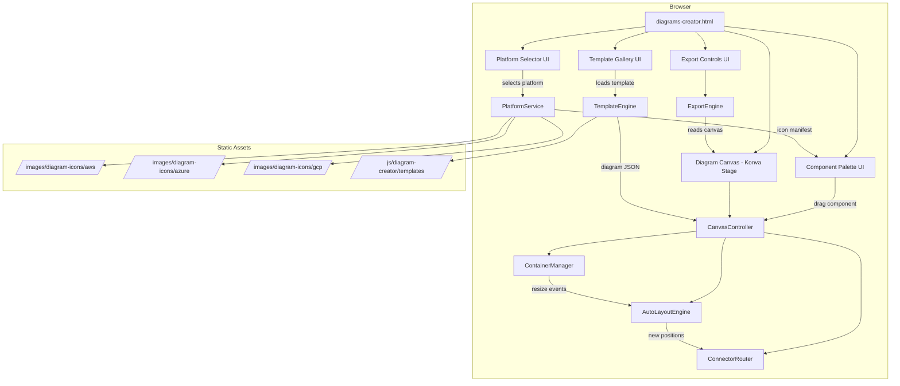
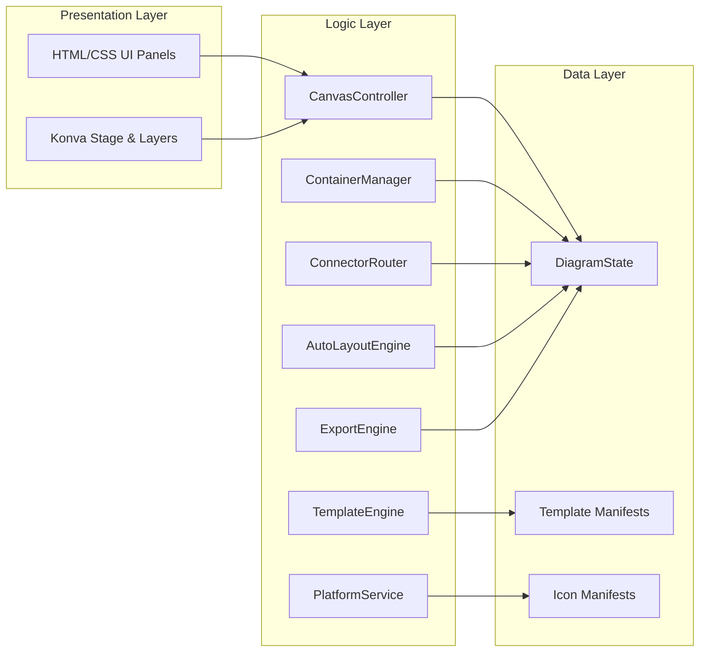

# Design Document: Architecture Diagram Creator

## Overview

The Architecture Diagram Creator is a client-side interactive web tool that enables UK government solution architects to create professional cloud architecture diagrams. It ships as a single static HTML page (`diagrams-creator.html`) with supporting JavaScript and CSS, integrated into the existing thesolutionarchitect.uk site and deployed on Netlify alongside existing content.

The tool uses **Konva.js** as its HTML5 Canvas rendering library for interactive diagram editing, combined with a custom auto-layout engine built on **dagre** for directed graph positioning. Export uses Konva's built-in `toDataURL()` for PNG and a custom SVG serialiser for vector output.

### Key Design Decisions

| Decision | Choice | Rationale |
|----------|--------|-----------|
| Canvas library | Konva.js (v9+) | Best-in-class drag-and-drop, event system, layering, node nesting. No framework dependency. Lightweight (~150KB minified). |
| Auto-layout | dagre | Proven directed graph layout. Handles hierarchical positioning needed for AZ redistribution. Client-side only. |
| Build approach | Vanilla JS module (ES modules via `<script type="module">`) | Matches existing site pattern — no build toolchain required for the static page. |
| Icon delivery | Static SVG/PNG files bundled in `/images/diagram-icons/{platform}/` | Meets offline requirement. No external API calls. |
| Export | Canvas `toDataURL` for PNG; manual SVG DOM serialisation for SVG | No server needed. Keeps everything client-side. |
| State management | Single in-memory JavaScript object (DiagramState) | No persistence needed per requirements. Simple, fast, testable. |

## Architecture



### Layer Architecture



## Components and Interfaces

### 1. PlatformService

Manages cloud platform selection and icon loading.

```typescript
interface PlatformService {
  getAvailablePlatforms(): Platform[];
  selectPlatform(platformId: string): void;
  getIconManifest(platformId: string): IconManifest;
  getIconUrl(platformId: string, serviceId: string): string;
  getCurrentPlatform(): Platform | null;
}

interface Platform {
  id: 'aws' | 'azure' | 'gcp';
  name: string;
  logoUrl: string;
}

interface IconManifest {
  platformId: string;
  categories: IconCategory[];
}

interface IconCategory {
  id: string;
  name: string;         // e.g. "Compute", "Storage", "Networking"
  services: ServiceIcon[];
}

interface ServiceIcon {
  id: string;
  name: string;         // e.g. "EC2", "S3", "Lambda"
  iconPath: string;     // relative path to SVG/PNG
  defaultWidth: number;
  defaultHeight: number;
}
```

### 2. TemplateEngine

Loads and instantiates architecture pattern templates.

```typescript
interface TemplateEngine {
  getTemplatesForPlatform(platformId: string): ArchitectureTemplate[];
  instantiateTemplate(templateId: string): DiagramState;
}

interface ArchitectureTemplate {
  id: string;
  platformId: string;
  name: string;           // e.g. "Public-Facing Web Service"
  description: string;
  thumbnailUrl: string;
  definition: TemplateDef;
}

interface TemplateDef {
  components: TemplateComponent[];
  containers: TemplateContainer[];
  connectors: TemplateConnector[];
}

interface TemplateComponent {
  id: string;
  serviceId: string;
  position: { x: number; y: number };
  parentContainerId?: string;
}

interface TemplateContainer {
  id: string;
  type: 'vpc' | 'subnet' | 'az' | 'resource-group' | 'region';
  label: string;
  parentContainerId?: string;
  children: string[];   // component/container IDs
}

interface TemplateConnector {
  id: string;
  sourceId: string;
  targetId: string;
  label?: string;
  directed: boolean;
}
```

### 3. CanvasController

Central orchestrator for all canvas interactions.

```typescript
interface CanvasController {
  initialise(containerId: string): void;
  loadDiagram(state: DiagramState): void;
  addComponent(serviceId: string, position: Point, containerId?: string): string;
  removeComponent(componentId: string): void;
  moveComponent(componentId: string, newPosition: Point): void;
  addContainer(type: ContainerType, position: Point, parentId?: string): string;
  removeContainer(containerId: string): void;
  startConnection(sourceId: string): void;
  completeConnection(targetId: string): void;
  removeConnection(connectorId: string): void;
  getState(): DiagramState;
  clearCanvas(): void;
}

interface Point {
  x: number;
  y: number;
}

type ContainerType = 'vpc' | 'subnet' | 'az' | 'resource-group' | 'region';
```

### 4. ContainerManager

Handles smart container auto-resize behaviour.

```typescript
interface ContainerManager {
  addChildToContainer(containerId: string, childId: string): void;
  removeChildFromContainer(containerId: string, childId: string): void;
  recalculateBounds(containerId: string): Rect;
  getContainerAtPoint(point: Point): string | null;
  getNestingLevel(containerId: string): number;
  getContainerStyle(nestingLevel: number): ContainerStyle;
}

interface Rect {
  x: number;
  y: number;
  width: number;
  height: number;
}

interface ContainerStyle {
  borderColor: string;
  backgroundColor: string;
  borderRadius: number;
  padding: number;
}
```

### 5. AutoLayoutEngine

Repositions components when structural changes occur (e.g. adding/removing AZs).

```typescript
interface AutoLayoutEngine {
  redistributeContainers(containers: ContainerNode[], direction: 'horizontal' | 'vertical'): LayoutResult;
  applyLayout(result: LayoutResult): void;
}

interface ContainerNode {
  id: string;
  width: number;
  height: number;
  children: string[];
}

interface LayoutResult {
  positions: Map<string, Point>;
  containerBounds: Map<string, Rect>;
}
```

### 6. ConnectorRouter

Renders and routes connection lines between components.

```typescript
interface ConnectorRouter {
  addConnector(sourceId: string, targetId: string, directed: boolean): string;
  removeConnector(connectorId: string): void;
  updateRoutes(): void;
  routeSingleConnector(connectorId: string): RoutePath;
  setConnectorLabel(connectorId: string, label: string): void;
}

interface RoutePath {
  points: Point[];
  sourceAnchor: Point;
  targetAnchor: Point;
}
```

### 7. ExportEngine

Converts the diagram canvas to downloadable image formats.

```typescript
interface ExportEngine {
  exportAsPng(options: PngExportOptions): Promise<Blob>;
  exportAsSvg(): string;
  triggerDownload(blob: Blob | string, filename: string): void;
}

interface PngExportOptions {
  pixelRatio: number;  // 2 for 150+ DPI at A4
  backgroundColor: string;
}
```

## Data Models

### DiagramState

The central data structure holding the entire diagram.

```typescript
interface DiagramState {
  id: string;
  platformId: 'aws' | 'azure' | 'gcp';
  templateId: string | null;
  components: Map<string, DiagramComponent>;
  containers: Map<string, DiagramContainer>;
  connectors: Map<string, DiagramConnector>;
}

interface DiagramComponent {
  id: string;
  serviceId: string;
  serviceName: string;
  iconPath: string;
  position: Point;
  size: { width: number; height: number };
  containerId: string | null;
  label: string;
}

interface DiagramContainer {
  id: string;
  type: ContainerType;
  label: string;
  bounds: Rect;
  parentId: string | null;
  childIds: string[];       // both components and nested containers
  nestingLevel: number;
  style: ContainerStyle;
}

interface DiagramConnector {
  id: string;
  sourceComponentId: string;
  targetComponentId: string;
  directed: boolean;
  label: string;
  routePath: RoutePath;
}
```

### Icon Manifest File Format (JSON)

Stored at `/js/diagram-creator/icons/{platform}.json`:

```json
{
  "platformId": "aws",
  "categories": [
    {
      "id": "compute",
      "name": "Compute",
      "services": [
        {
          "id": "ec2",
          "name": "EC2",
          "iconPath": "images/diagram-icons/aws/compute/ec2.svg",
          "defaultWidth": 48,
          "defaultHeight": 48
        }
      ]
    }
  ]
}
```

### Template File Format (JSON)

Stored at `/js/diagram-creator/templates/{platform}/{template-id}.json`:

```json
{
  "id": "aws-web-service",
  "platformId": "aws",
  "name": "Public-Facing Web Service",
  "description": "Classic multi-AZ web application with load balancer, compute, and managed database.",
  "thumbnailUrl": "images/diagram-templates/aws-web-service-thumb.png",
  "definition": {
    "components": [...],
    "containers": [...],
    "connectors": [...]
  }
}
```

## Correctness Properties

*A property is a characteristic or behavior that should hold true across all valid executions of a system — essentially, a formal statement about what the system should do. Properties serve as the bridge between human-readable specifications and machine-verifiable correctness guarantees.*

### Property 1: Template filtering by platform

*For any* collection of architecture templates with mixed platform tags, and any selected platform ID, the `getTemplatesForPlatform` function shall return only templates whose `platformId` matches the selected platform, and no templates for other platforms shall be included.

**Validates: Requirements 1.3**

### Property 2: Template instantiation completeness

*For any* valid template definition containing N components, M containers, and P connectors, instantiating that template shall produce a DiagramState containing exactly N components, M containers, and P connectors, each preserving its ID and configuration from the definition.

**Validates: Requirements 2.3, 2.5**

### Property 3: Component placement at specified position

*For any* valid service ID and any point (x, y) within the canvas bounds, adding a component at that position shall produce a DiagramComponent in the state at exactly that position with the correct iconPath for the service's platform.

**Validates: Requirements 3.2**

### Property 4: Palette search filtering

*For any* search string and any list of ServiceIcon objects, the filter function shall return exactly those services whose name contains the search string (case-insensitive), and no others.

**Validates: Requirements 3.4**

### Property 5: Container bounds encompass all children

*For any* Container_Component with any number of child components (including zero), the container's bounds shall fully encompass every child's bounding box plus consistent padding on all sides. This holds for containers at any nesting depth, where each level resizes independently based on its own direct children.

**Validates: Requirements 4.1, 4.2, 4.3**

### Property 6: Container parent-child relationship consistency

*For any* component moved into a container, the component's `containerId` shall equal that container's ID and the container's `childIds` shall include the component's ID. Conversely, for any component moved out of a container, the component's `containerId` shall be null and the container's `childIds` shall no longer include the component's ID.

**Validates: Requirements 4.4, 4.5**

### Property 7: Distinct container styles by nesting level

*For any* two containers at different nesting levels, the `getContainerStyle` function shall return ContainerStyle objects with different `backgroundColor` values, ensuring visual distinction between nesting levels.

**Validates: Requirements 4.6**

### Property 8: Even horizontal distribution of AZ containers

*For any* set of N Availability Zone containers (where N >= 2) after auto-layout redistribution, the horizontal spacing between consecutive AZs shall be equal within a 1-pixel tolerance, and the relative ordering of children within each AZ shall be preserved.

**Validates: Requirements 5.1, 5.2, 5.3**

### Property 9: Connector endpoint validity

*For any* connector in the diagram state, after any layout or position change, the connector's route path shall start at a point on or adjacent to the source component's bounding box and end at a point on or adjacent to the target component's bounding box, with at least 2 points in the path.

**Validates: Requirements 5.4, 6.1, 6.3**

### Property 10: Connector routing avoids obstacles

*For any* connector route path and set of component bounding boxes on the canvas (excluding the connector's source and target), no line segment of the route shall intersect any obstacle component's bounding box.

**Validates: Requirements 6.2**

### Property 11: SVG export completeness

*For any* DiagramState containing N components, M containers, P connectors, and L labels, the SVG export shall produce a document containing at least N image/use elements, M rect elements, P path/line elements, and L text elements.

**Validates: Requirements 7.3, 7.5**

### Property 12: PNG export minimum resolution

*For any* diagram state, PNG export with a pixelRatio of 2 shall produce an image with width of at least 1240 pixels and height of at least 1754 pixels (meeting 150 DPI at A4 size).

**Validates: Requirements 7.2**

### Property 13: No overlapping component bounding boxes after auto-layout

*For any* diagram state that has been processed by the AutoLayoutEngine, no two component bounding boxes shall intersect (components within the same container may be adjacent but not overlapping).

**Validates: Requirements 8.6**


## Error Handling

### Icon Loading Failures

| Scenario | Behaviour |
|----------|-----------|
| Icon SVG fails to load (404 or network error) | Display a placeholder rectangle with the service name as text. Log warning to console. Do not block diagram interaction. |
| Entire icon manifest fails to load | Display error message in the Component Palette: "Unable to load components. Please refresh the page." Disable drag-and-drop until resolved. |

### Template Loading Failures

| Scenario | Behaviour |
|----------|-----------|
| Template JSON fails to load | Display error toast: "Template could not be loaded. Please try another." Remove failed template from gallery. |
| Template JSON is malformed | Log parse error. Display same user message as above. Fall back gracefully. |

### Canvas Interaction Errors

| Scenario | Behaviour |
|----------|-----------|
| Drop position is outside canvas bounds | Snap component to nearest valid edge position within bounds. |
| Attempt to nest container inside itself | Reject the operation silently. Component stays at previous position. |
| Connector drawn from component to itself | Reject the operation. No connector is created. |
| Maximum nesting depth exceeded (>5 levels) | Reject the drop. Display brief tooltip: "Maximum nesting depth reached." |

### Export Errors

| Scenario | Behaviour |
|----------|-----------|
| Canvas is empty (no components) at export time | Disable export button. Show tooltip: "Add components before exporting." |
| PNG generation fails (canvas tainted or memory limit) | Display error message: "Export failed. Try reducing diagram complexity." |
| SVG serialisation produces invalid markup | Fall back to PNG-only export. Log error to console. |
| File download blocked by browser | Display message: "Download was blocked. Please allow downloads for this site." |

### Platform Change Errors

| Scenario | Behaviour |
|----------|-----------|
| User confirms platform change with unsaved work | Reset diagram state completely. Load new platform's icons and templates. No undo available — the confirmation dialog is the safeguard. |
| User cancels platform change | No state change. Return to current diagram. |

### Browser Compatibility

| Scenario | Behaviour |
|----------|-----------|
| Browser does not support HTML5 Canvas | Display static message: "Your browser does not support this tool. Please use a modern browser (Chrome, Firefox, Edge, Safari)." |
| Browser does not support ES Modules | Same fallback message as above. Detected via `<script nomodule>` tag. |

## Testing Strategy

### Unit Tests (Vitest + happy-dom)

Focus on pure logic functions that don't require canvas rendering:

- **PlatformService**: Correct manifest loading, platform switching, icon URL resolution
- **TemplateEngine**: Template filtering, instantiation, validation
- **ContainerManager**: Bounds calculation, nesting level computation, child adoption/release
- **AutoLayoutEngine**: Position redistribution, relative ordering preservation
- **ConnectorRouter**: Route calculation, obstacle avoidance, endpoint computation
- **ExportEngine**: SVG serialisation correctness, dimension calculations
- **Search/Filter**: Palette filtering logic

### Property-Based Tests (Vitest + fast-check)

The project already uses `fast-check` (v3.23.1) for property-based testing. Each correctness property maps to a single property-based test with a minimum of 100 iterations.

**Configuration:**
- Library: fast-check (already in devDependencies)
- Runner: Vitest (already configured)
- Iterations: 100 minimum per property
- Test file pattern: `tests/diagram-creator/*.property.test.ts`

**Tag format for each test:**
```typescript
// Feature: architecture-diagram-creator, Property 1: Template filtering by platform
```

**Property test implementation approach:**
- Generate random template collections, diagram states, positions, and service lists using fast-check arbitraries
- Test pure logic functions (filtering, bounds calculation, layout, routing) in isolation
- Mock Konva rendering layer — test the data transformations, not the canvas pixels

### Integration Tests

- Template loading end-to-end (fetch JSON, parse, instantiate)
- Full drag-and-drop flow with Konva stage (using happy-dom + Konva's Node.js mode)
- Export pipeline (generate PNG blob, verify dimensions; generate SVG string, verify element count)
- Performance benchmarks for layout recalculation (<1 second) and export (<5 seconds)

### Manual Testing Checklist

- Visual quality assessment across all 3 platforms
- Drag-and-drop usability on desktop browsers (Chrome, Firefox, Edge, Safari)
- Exported PNG/SVG quality in printed documents
- Offline functionality after initial page load
- Navigation integration with existing site
- Accessibility: keyboard navigation, screen reader compatibility for UI panels

### Test File Structure

```
tests/
  diagram-creator/
    platform-service.test.ts
    template-engine.test.ts
    container-manager.test.ts
    auto-layout-engine.test.ts
    connector-router.test.ts
    export-engine.test.ts
    palette-filter.test.ts
    diagram-creator.property.test.ts   ← all 13 property tests
```
