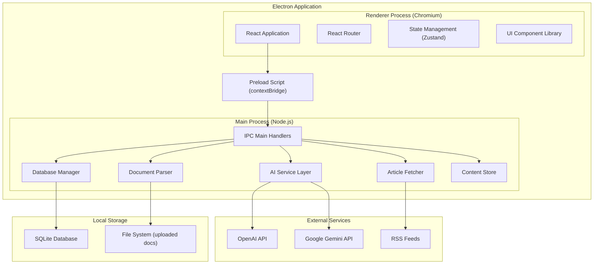
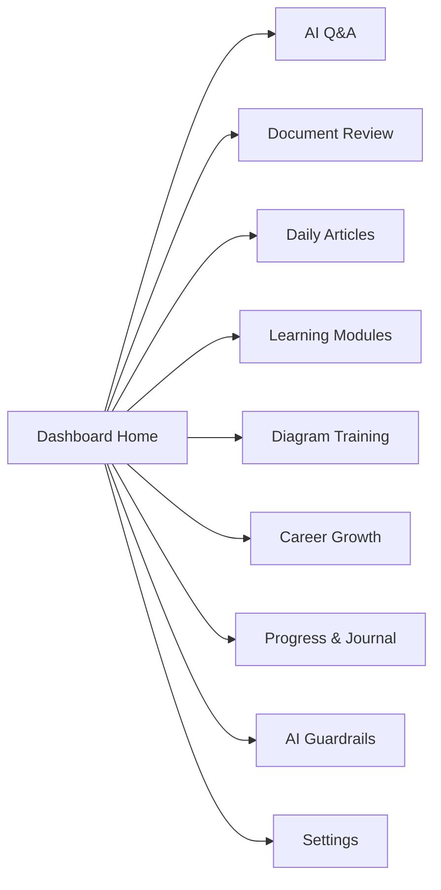

# Design Document — ArchLens

## Overview

ArchLens is a Windows-only Electron desktop application that serves as a personal growth companion for UK government solution architects. It combines AI-powered architectural Q&A, design document review, curated daily articles, bite-sized learning modules, career development tracking, architectural diagramming training, and AI governance knowledge into a single dashboard-oriented interface.

The application follows a standard Electron architecture with a main process handling system-level operations (file I/O, AI API calls, local database) and a renderer process presenting a React-based UI. All AI features use a pluggable provider abstraction supporting both OpenAI and Google Gemini APIs. User data is persisted locally using SQLite via `better-sqlite3`.

### Key Design Decisions

| Decision | Choice | Rationale |
|---|---|---|
| UI Framework | React + TypeScript | Strong ecosystem, component model suits dashboard UI, excellent Electron integration |
| AI Provider | Dual support — OpenAI (GPT-4o) recommended as default, Gemini as alternative | GPT-4o offers strong reasoning for architecture analysis; Gemini provides a cost-effective alternative. User has keys for both. |
| Local Storage | SQLite via `better-sqlite3` | Structured relational data (progress, certifications, journal entries) suits SQL; `better-sqlite3` is synchronous, fast, and well-supported in Electron |
| Document Parsing | `pdf-parse` (PDF), `mammoth` (DOCX), native `fs` (TXT) | Pure JS libraries with no OS dependencies, well-maintained, suitable for Electron packaging |
| Article Curation | RSS feed aggregation via `rss-parser` | Lightweight, no API keys needed, broad source coverage, easy to add/remove feeds |
| IPC Pattern | `contextBridge` + preload scripts | Electron security best practice — renderer has no direct Node.js access |
| Build/Package | `electron-builder` | Mature tooling for Windows installers (NSIS), auto-update support |

### AI Provider Recommendation

Both OpenAI and Google Gemini are capable, but **OpenAI GPT-4o is recommended as the default** for ArchLens:

- Stronger performance on structured analysis tasks (document review, framework compliance assessment)
- More consistent output formatting for traffic-light ratings and structured feedback
- Larger ecosystem of prompt engineering patterns for document analysis
- Gemini remains a solid fallback — particularly cost-effective for high-volume Q&A usage

The provider abstraction means the user can switch at any time via settings.

## Architecture

### High-Level Architecture



### Process Architecture

The application follows Electron's two-process model:

**Main Process** — Runs in Node.js. Handles all privileged operations:
- AI API calls (OpenAI / Gemini)
- File system access (document uploads, SQLite database)
- RSS feed fetching
- System tray, menus, window management

**Renderer Process** — Runs in Chromium. Handles all UI:
- React component tree
- State management via Zustand
- Routing between feature areas
- No direct access to Node.js APIs

**Preload Script** — Bridges the two processes securely:
- Exposes a typed `window.archlens` API via `contextBridge`
- All IPC calls are explicitly whitelisted
- No `nodeIntegration`, no `remote` module

### Navigation Architecture




## Components and Interfaces

### 1. AI Service Layer (`src/main/services/ai-service.ts`)

Provides a unified interface for interacting with either AI provider. Handles prompt construction, conversation context, timeouts, and error mapping.

```typescript
interface AIProvider {
  name: 'openai' | 'gemini';
  sendMessage(prompt: string, context: ConversationContext): Promise<AIResponse>;
  validateApiKey(key: string): Promise<boolean>;
}

interface AIResponse {
  content: string;
  tokensUsed: { prompt: number; completion: number };
  model: string;
  latencyMs: number;
}

interface ConversationContext {
  sessionId: string;
  messages: Array<{ role: 'user' | 'assistant' | 'system'; content: string }>;
  systemPrompt: string;
}

interface AIService {
  ask(question: string, sessionId: string): Promise<AIResponse>;
  reviewDocument(text: string, mode: 'quick' | 'deep'): Promise<DocumentReview>;
  switchProvider(provider: 'openai' | 'gemini'): Promise<void>;
  validateKey(provider: 'openai' | 'gemini', key: string): Promise<boolean>;
}
```

**System Prompt Strategy**: The AI service prepends a UK government architecture context system prompt covering GDS Service Standard, Secure by Design, Zero Trust, TOGAF, and Well-Architected Framework principles. This ensures all responses are tailored to the user's domain.

**Timeout Handling**: Each API call has a 15-second timeout. On timeout, the promise rejects with a typed `AITimeoutError`. The renderer displays a retry option.

**Conversation Context**: Maintained per session in memory. Each session stores the message history array. Context is cleared when the user starts a new session or closes the Q&A panel.

### 2. Document Parser (`src/main/services/document-parser.ts`)

Handles file ingestion and text extraction from supported formats.

```typescript
interface ParsedDocument {
  text: string;
  metadata: {
    filename: string;
    format: 'pdf' | 'docx' | 'txt';
    pageCount: number;
    wordCount: number;
    hasDiagrams: boolean;
  };
  warnings: string[]; // e.g., "Diagram detected on page 3 — flagged for manual review"
}

interface DocumentParser {
  parse(filePath: string): Promise<ParsedDocument>;
  getSupportedFormats(): string[];
  validateFile(filePath: string): Promise<ValidationResult>;
}
```

**Implementation Details**:
- PDF: `pdf-parse` extracts text; image-heavy pages are flagged via low text-to-page ratio heuristic
- DOCX: `mammoth` converts to plain text; embedded images are detected and flagged
- TXT: Direct `fs.readFile` with encoding detection
- File size limit: 50 pages / ~10MB to stay within AI provider context windows
- Corrupted files: Caught via try/catch around parser calls, mapped to descriptive error messages

### 3. Document Reviewer (`src/main/services/document-reviewer.ts`)

Orchestrates document analysis using the AI service, producing structured review output.

```typescript
interface TrafficLightRating {
  area: ReviewArea;
  rating: 'green' | 'amber' | 'red';
  summary: string;
}

type ReviewArea =
  | 'gds-service-standard'
  | 'secure-by-design'
  | 'zero-trust'
  | 'technical-feasibility'
  | 'communication-clarity';

interface QuickOverview {
  ratings: TrafficLightRating[];
  overallSummary: string;
  generatedAt: Date;
}

interface DeepDiveSection {
  area: ReviewArea;
  feedback: string;
  suggestions: string[];
  frameworkReferences: string[];
}

interface DeepDiveReview {
  sections: DeepDiveSection[];
  overallAssessment: string;
  generatedAt: Date;
}

interface DocumentReviewer {
  quickOverview(doc: ParsedDocument): Promise<QuickOverview>;
  deepDive(doc: ParsedDocument): Promise<DeepDiveReview>;
}
```

**Prompt Engineering**: The reviewer constructs structured prompts that instruct the AI to evaluate each review area independently and return JSON-structured responses. A response parser validates the AI output and maps it to the typed interfaces.

### 4. Article Curator (`src/main/services/article-curator.ts`)

Fetches and caches articles from configured RSS feeds.

```typescript
interface Article {
  id: string;
  title: string;
  source: string;
  url: string;
  publishedDate: Date;
  summary: string;
  category: ArticleCategory;
}

type ArticleCategory =
  | 'architecture'
  | 'cloud'
  | 'cybersecurity'
  | 'government-digital'
  | 'enterprise-tech';

interface ArticleCurator {
  getDaily(): Promise<Article[]>;
  refresh(): Promise<Article[]>;
  getCached(): Article[];
  setRefreshTime(hour: number, minute: number): void;
}
```

**Feed Sources**: Pre-configured list of RSS feeds covering:
- AWS Architecture Blog, Azure Architecture Center, Google Cloud Blog
- NCSC (National Cyber Security Centre), GOV.UK Technology blog
- InfoQ Architecture, Martin Fowler, ThoughtWorks Radar
- The Register, Ars Technica (enterprise/cloud sections)

**Caching**: Articles are cached in SQLite with a 48-hour retention. If network fetch fails, the cached list is served with a staleness indicator.

**Scheduling**: A `setInterval`-based scheduler triggers refresh at the user-configured time. Default: 07:00.

### 5. Learning Module Engine (`src/main/services/learning-engine.ts`)

Manages static learning content bundled with the application.

```typescript
interface LearningModule {
  id: string;
  title: string;
  category: LearningCategory;
  sequenceOrder: number;
  estimatedMinutes: number;
  content: ModuleContent;
}

interface ModuleContent {
  sections: ContentSection[];
  keyTakeaways: string[];
  practicalExamples: string[];
}

interface ContentSection {
  heading: string;
  body: string; // Markdown
}

type LearningCategory =
  | 'aws-well-architected'
  | 'azure-well-architected'
  | 'togaf'
  | 'gds-service-standard'
  | 'secure-by-design'
  | 'zero-trust'
  | 'enterprise-architecture'
  | 'solution-architecture';

interface LearningEngine {
  getCategories(): LearningCategory[];
  getModules(category: LearningCategory): LearningModule[];
  getModule(id: string): LearningModule;
  completeModule(userId: string, moduleId: string): void;
  getNextRecommended(userId: string, category: LearningCategory): LearningModule | null;
}
```

**Content Storage**: Learning modules are stored as Markdown files in the application bundle under `resources/content/modules/`. The engine reads and parses them at startup, indexing by category and sequence.

### 6. Career Tracker (`src/main/services/career-tracker.ts`)

Manages certifications, gap analysis, and career recommendations.

```typescript
interface Certification {
  id: string;
  name: string;
  provider: string;
  dateEarned: Date;
  expiryDate?: Date;
}

interface SkillGap {
  capability: string;
  currentLevel: DDATLevel;
  targetLevel: DDATLevel;
  recommendations: Recommendation[];
}

type DDATLevel = 'awareness' | 'working' | 'practitioner' | 'expert';

interface Recommendation {
  type: 'certification' | 'course' | 'learning-path';
  title: string;
  provider: string;
  url?: string;
  relevantCapability: string;
}

interface CareerTracker {
  addCertification(cert: Certification): void;
  removeCertification(id: string): void;
  getCertifications(): Certification[];
  analyseGaps(targetRole: string): SkillGap[];
  getRecommendations(targetRole: string): Recommendation[];
  getCapabilityCoverage(targetRole: string): CapabilityCoverage;
}

interface CapabilityCoverage {
  capabilities: Array<{
    name: string;
    currentLevel: DDATLevel;
    targetLevel: DDATLevel;
    coveragePercent: number;
  }>;
  overallCoveragePercent: number;
}
```

**DDAT Framework Data**: The DDAT capability definitions for solution architecture roles are stored as a JSON data file bundled with the app. Gap analysis compares the user's certifications and completed modules against the target role's capability requirements.

### 7. Diagram Coach (`src/main/services/diagram-coach.ts`)

Manages diagramming training content, exercises, and the ArchiMate reference library.

```typescript
interface DiagramModule {
  id: string;
  title: string;
  diagramType: DiagramType;
  content: DiagramContent;
  sequenceOrder: number;
}

type DiagramType =
  | 'archimate'
  | 'solution-overview'
  | 'data-flow'
  | 'sequence'
  | 'network-topology'
  | 'deployment';

interface DiagramContent {
  explanation: string; // Markdown
  annotatedExamples: AnnotatedExample[];
  walkthrough: WalkthroughStep[];
  exercises: Exercise[];
  commonMistakes: Mistake[];
}

interface AnnotatedExample {
  imageUrl: string; // relative path to bundled image
  annotations: Array<{ element: string; explanation: string }>;
}

interface WalkthroughStep {
  stepNumber: number;
  instruction: string;
  imageUrl: string; // progressive diagram build
}

interface Exercise {
  scenario: string;
  expectedDiagramType: DiagramType;
  hints: string[];
  sampleSolution: string; // path to reference image
}

interface Mistake {
  description: string;
  incorrectExample: string;
  correctedExample: string;
  explanation: string;
}

interface ArchiMateReference {
  symbols: ArchiMateSymbol[];
  relationships: ArchiMateRelationship[];
  layers: ArchiMateLayer[];
}

interface DiagramCoach {
  getModules(type?: DiagramType): DiagramModule[];
  getModule(id: string): DiagramModule;
  getReference(): ArchiMateReference;
  completeModule(moduleId: string): void;
  getNextRecommended(type?: DiagramType): DiagramModule | null;
  getAudienceGuidance(audience: 'technical' | 'governance' | 'non-technical'): string;
}
```

### 8. Progress Dashboard (`src/main/services/progress-service.ts`)

Aggregates progress data across all learning subsystems.

```typescript
interface ProgressSummary {
  totalModulesCompleted: number;
  totalCertificationsEarned: number;
  totalArticlesRead: number;
  completionRates: Record<LearningCategory, number>;
  diagramModulesCompleted: number;
}

interface TimelineEntry {
  date: Date;
  type: 'module' | 'certification' | 'article' | 'journal' | 'diagram-module';
  title: string;
  category?: string;
}

interface JournalEntry {
  id: string;
  content: string;
  createdAt: Date;
  tags: string[];
}

interface ProgressService {
  getSummary(): ProgressSummary;
  getTimeline(period: 'weekly' | 'monthly' | 'quarterly'): TimelineEntry[];
  addJournalEntry(content: string, tags: string[]): JournalEntry;
  getJournalEntries(filter?: { tags?: string[]; from?: Date; to?: Date }): JournalEntry[];
  exportReport(period: 'monthly' | 'quarterly' | 'yearly'): string; // Generates formatted text
}
```

### 9. Guardrails Knowledge Base (`src/main/services/guardrails-service.ts`)

Serves structured AI governance content.

```typescript
interface GuardrailsTopic {
  id: string;
  title: string;
  category: 'governance' | 'security' | 'data-protection';
  content: string; // Markdown
  lastUpdated: Date;
}

interface GuardrailsService {
  getTopics(): GuardrailsTopic[];
  getTopic(id: string): GuardrailsTopic;
  getByCategory(category: string): GuardrailsTopic[];
}
```

**Content Updates**: Guardrails content is bundled as Markdown files. Updates are delivered via application updates (electron-builder auto-update). The `lastUpdated` field tracks content freshness.

### 10. IPC Bridge (`src/main/ipc/handlers.ts` + `src/preload/index.ts`)

Defines the secure communication channel between renderer and main processes.

```typescript
// Exposed on window.archlens via contextBridge
interface ArchLensAPI {
  ai: {
    ask(question: string, sessionId: string): Promise<AIResponse>;
    reviewQuick(filePath: string): Promise<QuickOverview>;
    reviewDeep(filePath: string): Promise<DeepDiveReview>;
    switchProvider(provider: 'openai' | 'gemini'): Promise<void>;
    validateKey(provider: 'openai' | 'gemini', key: string): Promise<boolean>;
  };
  documents: {
    upload(filePath: string): Promise<ParsedDocument>;
    getSupportedFormats(): string[];
  };
  articles: {
    getDaily(): Promise<Article[]>;
    refresh(): Promise<Article[]>;
    openInBrowser(url: string): void;
  };
  learning: {
    getCategories(): LearningCategory[];
    getModules(category: LearningCategory): LearningModule[];
    completeModule(moduleId: string): void;
    getNextRecommended(category: LearningCategory): LearningModule | null;
  };
  diagrams: {
    getModules(type?: DiagramType): DiagramModule[];
    getModule(id: string): DiagramModule;
    getReference(): ArchiMateReference;
    completeModule(moduleId: string): void;
  };
  career: {
    addCertification(cert: Certification): void;
    getCertifications(): Certification[];
    analyseGaps(targetRole: string): SkillGap[];
    getRecommendations(targetRole: string): Recommendation[];
    getCoverage(targetRole: string): CapabilityCoverage;
  };
  progress: {
    getSummary(): ProgressSummary;
    getTimeline(period: 'weekly' | 'monthly' | 'quarterly'): TimelineEntry[];
    addJournal(content: string, tags: string[]): JournalEntry;
    getJournalEntries(filter?: object): JournalEntry[];
    exportReport(period: string): string;
  };
  guardrails: {
    getTopics(): GuardrailsTopic[];
    getTopic(id: string): GuardrailsTopic;
  };
  settings: {
    get(): AppSettings;
    update(settings: Partial<AppSettings>): void;
  };
}
```


## Data Models

### SQLite Database Schema

The application uses a single SQLite database file stored in the Electron `userData` directory.

```sql
-- User settings and preferences
CREATE TABLE settings (
    key TEXT PRIMARY KEY,
    value TEXT NOT NULL,
    updated_at TEXT NOT NULL DEFAULT (datetime('now'))
);

-- Uploaded documents and their parsed metadata
CREATE TABLE documents (
    id TEXT PRIMARY KEY,
    filename TEXT NOT NULL,
    format TEXT NOT NULL CHECK (format IN ('pdf', 'docx', 'txt')),
    file_path TEXT NOT NULL,
    page_count INTEGER,
    word_count INTEGER,
    has_diagrams INTEGER NOT NULL DEFAULT 0,
    uploaded_at TEXT NOT NULL DEFAULT (datetime('now'))
);

-- Document review results (both quick and deep)
CREATE TABLE document_reviews (
    id TEXT PRIMARY KEY,
    document_id TEXT NOT NULL REFERENCES documents(id),
    mode TEXT NOT NULL CHECK (mode IN ('quick', 'deep')),
    result_json TEXT NOT NULL, -- JSON blob of QuickOverview or DeepDiveReview
    created_at TEXT NOT NULL DEFAULT (datetime('now'))
);

-- User certifications and qualifications
CREATE TABLE certifications (
    id TEXT PRIMARY KEY,
    name TEXT NOT NULL,
    provider TEXT NOT NULL,
    date_earned TEXT NOT NULL,
    expiry_date TEXT,
    created_at TEXT NOT NULL DEFAULT (datetime('now'))
);

-- Learning module completion tracking
CREATE TABLE module_completions (
    id TEXT PRIMARY KEY,
    module_id TEXT NOT NULL,
    module_type TEXT NOT NULL CHECK (module_type IN ('learning', 'diagram')),
    completed_at TEXT NOT NULL DEFAULT (datetime('now')),
    UNIQUE(module_id, module_type)
);

-- Cached articles from RSS feeds
CREATE TABLE articles (
    id TEXT PRIMARY KEY,
    title TEXT NOT NULL,
    source TEXT NOT NULL,
    url TEXT NOT NULL UNIQUE,
    published_date TEXT NOT NULL,
    summary TEXT,
    category TEXT NOT NULL,
    fetched_at TEXT NOT NULL DEFAULT (datetime('now'))
);

-- Articles the user has read (clicked through)
CREATE TABLE article_reads (
    id TEXT PRIMARY KEY,
    article_id TEXT NOT NULL REFERENCES articles(id),
    read_at TEXT NOT NULL DEFAULT (datetime('now'))
);

-- Personal development journal entries
CREATE TABLE journal_entries (
    id TEXT PRIMARY KEY,
    content TEXT NOT NULL,
    created_at TEXT NOT NULL DEFAULT (datetime('now'))
);

-- Journal entry tags (many-to-many)
CREATE TABLE journal_tags (
    journal_id TEXT NOT NULL REFERENCES journal_entries(id),
    tag TEXT NOT NULL,
    PRIMARY KEY (journal_id, tag)
);

-- AI conversation sessions
CREATE TABLE ai_sessions (
    id TEXT PRIMARY KEY,
    started_at TEXT NOT NULL DEFAULT (datetime('now')),
    last_message_at TEXT NOT NULL DEFAULT (datetime('now'))
);

-- AI conversation messages
CREATE TABLE ai_messages (
    id TEXT PRIMARY KEY,
    session_id TEXT NOT NULL REFERENCES ai_sessions(id),
    role TEXT NOT NULL CHECK (role IN ('user', 'assistant', 'system')),
    content TEXT NOT NULL,
    tokens_used INTEGER,
    created_at TEXT NOT NULL DEFAULT (datetime('now'))
);
```

### Application Settings Model

```typescript
interface AppSettings {
  aiProvider: 'openai' | 'gemini';
  openaiApiKey: string; // encrypted at rest
  geminiApiKey: string; // encrypted at rest
  articleRefreshHour: number; // 0-23
  articleRefreshMinute: number; // 0-59
  targetRole: string; // DDAT role identifier
  theme: 'light' | 'dark';
}
```

**API Key Security**: API keys are encrypted using Electron's `safeStorage` API before being stored in the settings table. Keys are decrypted only in the main process when making API calls. The renderer process never has access to raw API keys.

### Content File Structure

Static content is bundled with the application:

```
resources/
├── content/
│   ├── modules/                    # Learning modules (Markdown)
│   │   ├── aws-well-architected/
│   │   ├── azure-well-architected/
│   │   ├── togaf/
│   │   ├── gds-service-standard/
│   │   ├── secure-by-design/
│   │   ├── zero-trust/
│   │   ├── enterprise-architecture/
│   │   └── solution-architecture/
│   ├── diagrams/                   # Diagram training modules
│   │   ├── archimate/
│   │   ├── solution-overview/
│   │   ├── data-flow/
│   │   ├── sequence/
│   │   ├── network-topology/
│   │   └── deployment/
│   ├── guardrails/                 # AI governance content
│   │   ├── governance/
│   │   ├── security/
│   │   └── data-protection/
│   ├── reference/                  # ArchiMate reference library
│   │   ├── symbols.json
│   │   ├── relationships.json
│   │   └── layers.json
│   └── ddat/                       # DDAT framework data
│       └── capabilities.json
├── images/                         # Diagram examples, annotations
│   ├── diagrams/
│   └── archimate/
└── feeds.json                      # RSS feed configuration
```


## Correctness Properties

*A property is a characteristic or behavior that should hold true across all valid executions of a system — essentially, a formal statement about what the system should do. Properties serve as the bridge between human-readable specifications and machine-verifiable correctness guarantees.*

### Property 1: System prompt includes required UK government frameworks

*For any* question string submitted to the AI service, the constructed system prompt passed to the AI provider should contain references to "GDS Service Standard", "Secure by Design", and "Zero Trust".

**Validates: Requirements 1.3**

### Property 2: Conversation context accumulates all messages in order

*For any* sequence of user and assistant messages added to a conversation session, the context object passed to the AI provider for the next call should contain all previous messages in chronological order with correct roles.

**Validates: Requirements 1.4**

### Property 3: AI error mapping produces descriptive user-facing messages

*For any* AI provider error (rate limit, authentication failure, server error, network error, unknown error), the error mapper should produce a non-empty user-facing message that is distinct from the raw error string and contains the error category.

**Validates: Requirements 1.6**

### Property 4: File format validation accepts only supported formats

*For any* file path string, the format validator should return `true` if and only if the file extension (case-insensitive) is one of `pdf`, `docx`, or `txt`. For rejected files, the error message should list all three supported formats.

**Validates: Requirements 2.1, 2.3**

### Property 5: Diagram detection flags low-text pages

*For any* parsed document page where the text-to-area ratio falls below the detection threshold, the parser's warnings array should contain a diagram flag referencing that page number.

**Validates: Requirements 2.5**

### Property 6: Review output covers all required review areas

*For any* QuickOverview or DeepDiveReview result, the output should contain exactly one entry for each of the five required review areas: GDS Service Standard, Secure by Design, Zero Trust, technical feasibility, and communication clarity.

**Validates: Requirements 3.1, 3.2, 4.1**

### Property 7: Every traffic-light rating has a non-empty summary

*For any* TrafficLightRating in a QuickOverview result, regardless of whether the rating is green, amber, or red, the summary field should be a non-empty string.

**Validates: Requirements 3.3, 3.4, 3.5**

### Property 8: Deep dive sections include suggestions and framework references

*For any* DeepDiveSection in a DeepDiveReview result, the suggestions array should contain at least one entry and the frameworkReferences array should contain at least one entry.

**Validates: Requirements 4.2**

### Property 9: Daily article filter returns only recent articles

*For any* list of articles with random publication dates, the daily filter should return only articles where the publishedDate is within the last 24 hours of the current time, and should exclude all articles older than 24 hours.

**Validates: Requirements 5.1**

### Property 10: Article objects have all required display fields

*For any* Article object returned by the curator, the title, source, publishedDate, and summary fields should all be non-null and non-empty.

**Validates: Requirements 5.3**

### Property 11: Learning modules are ordered by sequence within each category

*For any* learning category, the list of modules returned by getModules should have sequenceOrder values in strictly increasing order.

**Validates: Requirements 6.2**

### Property 12: Learning module content has required structural elements

*For any* LearningModule, the content should have a non-empty sections array, a non-empty keyTakeaways array, and a non-empty practicalExamples array.

**Validates: Requirements 6.3**

### Property 13: Module completion round-trip

*For any* module ID (learning or diagram type), calling completeModule and then querying completions should return a record with that module ID, the correct module type, and a valid completion timestamp.

**Validates: Requirements 6.4, 10.5**

### Property 14: Next recommended module follows sequence order

*For any* completed module that is not the last in its category, getNextRecommended should return the module with the next higher sequenceOrder in the same category. For the last module in a category, it should return null.

**Validates: Requirements 6.5**

### Property 15: Learning modules are completable within 15 minutes

*For any* LearningModule, the total word count across all content sections should not exceed 3750 words (based on 250 words per minute average reading speed).

**Validates: Requirements 6.6**

### Property 16: Certification storage round-trip

*For any* valid Certification object, calling addCertification and then getCertifications should return a list containing a certification whose name, provider, dateEarned, and expiryDate match the original.

**Validates: Requirements 7.1**

### Property 17: Gap analysis identifies only genuine gaps

*For any* set of user certifications and a target role, every SkillGap returned by analyseGaps should have a currentLevel that is strictly lower than the targetLevel according to the DDAT level ordering (awareness < working < practitioner < expert).

**Validates: Requirements 7.2**

### Property 18: Gap recommendations are valid and reference DDAT capabilities

*For any* SkillGap in the analysis result, the recommendations array should contain at least one entry, and every Recommendation's relevantCapability should match a capability name defined in the DDAT framework data.

**Validates: Requirements 7.3, 7.4**

### Property 19: Capability coverage percentages are bounded and consistent

*For any* CapabilityCoverage result, all individual coveragePercent values should be between 0 and 100 inclusive, and overallCoveragePercent should equal the arithmetic mean of the individual coveragePercent values (within floating-point tolerance).

**Validates: Requirements 7.6**

### Property 20: Progress summary counts match actual records

*For any* set of module completions, certifications, and article reads in the database, the ProgressSummary's totalModulesCompleted, totalCertificationsEarned, and totalArticlesRead should equal the respective record counts.

**Validates: Requirements 8.1, 8.5**

### Property 21: Timeline filtering returns only entries within the selected period

*For any* set of timeline entries and a selected period (weekly, monthly, quarterly), all entries returned by getTimeline should have dates within the period's date range, and no entries within the range should be excluded.

**Validates: Requirements 8.3**

### Property 22: Journal entry round-trip

*For any* journal content string and tag array, calling addJournalEntry and then getJournalEntries should return an entry with matching content, matching tags, and a valid createdAt timestamp.

**Validates: Requirements 8.4**

### Property 23: Progress export contains key metrics

*For any* non-empty progress data and selected period, exportReport should return a non-empty string that contains the total modules completed count, certifications earned count, and the period label.

**Validates: Requirements 8.6**

### Property 24: Guardrails topics have valid categories

*For any* GuardrailsTopic returned by the service, the category field should be one of 'governance', 'security', or 'data-protection'.

**Validates: Requirements 9.4**

### Property 25: Diagram module content is structurally complete

*For any* DiagramModule, the content should have: a non-empty annotatedExamples array where each example has a non-empty annotations array; a non-empty walkthrough array; a non-empty exercises array where each exercise has a non-empty scenario; and a non-empty commonMistakes array where each mistake has description, incorrectExample, correctedExample, and explanation fields.

**Validates: Requirements 10.3, 10.4, 10.7, 10.8**

### Property 26: Diagram walkthrough steps are in order

*For any* DiagramModule, the walkthrough steps should have stepNumber values in strictly increasing order starting from 1.

**Validates: Requirements 10.4**

### Property 27: ArchiMate reference library is complete

*For any* call to getReference(), the returned ArchiMateReference should have non-empty symbols, relationships, and layers arrays, and every symbol should have a non-empty name and description.

**Validates: Requirements 10.6**


## Error Handling

### Error Categories and Strategies

| Error Category | Source | Strategy | User Experience |
|---|---|---|---|
| AI Provider Timeout | OpenAI / Gemini API | 15-second timeout, reject with `AITimeoutError` | "The AI service didn't respond in time. Please try again." + Retry button |
| AI Provider Error | OpenAI / Gemini API | Map HTTP status codes to typed errors | Descriptive message per error type (rate limit, auth, server) |
| Network Failure | Any external call | Detect via `fetch` error or `net` module | "No internet connection. Please check your connection and try again." + Retry button |
| File Parse Error | Document upload | Catch parser exceptions, map to `DocumentParseError` | "This file couldn't be processed. It may be corrupted or password-protected." |
| Unsupported Format | Document upload | Validate extension before parsing | "Unsupported file format. Please upload a PDF, Word (.docx), or plain text (.txt) file." |
| File Too Large | Document upload | Check file size before parsing | "This file exceeds the 50-page / 10MB limit. Please upload a smaller document." |
| API Key Invalid | Settings / provider switch | Validate key via test API call | "This API key is invalid. Please check the key and try again." |
| RSS Fetch Failure | Article curation | Serve cached articles, set staleness flag | Cached articles shown with banner: "Articles may not be current — last updated [time]." |
| Database Error | SQLite operations | Log error, show generic message | "Something went wrong saving your data. Please try again." |

### Error Handling Architecture

```typescript
// Base error class for all ArchLens errors
class ArchLensError extends Error {
  constructor(
    message: string,
    public readonly code: string,
    public readonly userMessage: string,
    public readonly retryable: boolean
  ) {
    super(message);
  }
}

class AITimeoutError extends ArchLensError {
  constructor() {
    super(
      'AI provider did not respond within 15 seconds',
      'AI_TIMEOUT',
      'The AI service didn\'t respond in time. Please try again.',
      true
    );
  }
}

class AIProviderError extends ArchLensError {
  constructor(statusCode: number, providerMessage: string) {
    const { code, userMessage, retryable } = mapAIError(statusCode, providerMessage);
    super(providerMessage, code, userMessage, retryable);
  }
}

class DocumentParseError extends ArchLensError { /* ... */ }
class NetworkError extends ArchLensError { /* ... */ }
class ValidationError extends ArchLensError { /* ... */ }
```

### Error Flow

1. Errors originate in main process services
2. Services throw typed `ArchLensError` subclasses
3. IPC handlers catch errors and serialize them across the process boundary
4. Renderer receives `{ success: false, error: { code, userMessage, retryable } }`
5. UI components display `userMessage` and show retry button if `retryable` is true
6. All errors are logged to a local log file via `electron-log`

### Graceful Degradation

- **AI features offline**: Q&A and document review show connection error with retry. All other features remain functional.
- **RSS feeds unreachable**: Cached articles served with staleness banner. If no cache exists, show "No articles available — please check your connection."
- **Database corruption**: On startup, run integrity check. If corrupted, offer to reset database (losing local data) or exit.

## Testing Strategy

### Testing Framework

- **Unit tests**: Vitest (fast, TypeScript-native, good Electron compatibility)
- **Property-based tests**: `fast-check` with Vitest
- **E2E tests**: Playwright (Electron support via `electron` fixture)

### Dual Testing Approach

**Unit tests** cover:
- Specific examples and edge cases (corrupted files, empty inputs, boundary values)
- Integration points between components (IPC handler → service → database)
- Error condition handling (timeout, network failure, invalid API key)
- UI component rendering (React Testing Library)

**Property-based tests** cover:
- Universal properties that hold across all valid inputs (Properties 1–27)
- Comprehensive input coverage through randomised generation
- Each property test runs a minimum of 100 iterations
- Each test is tagged with: `Feature: archlens, Property {number}: {property_text}`

### Test Organisation

```
tests/
├── unit/
│   ├── services/
│   │   ├── ai-service.test.ts
│   │   ├── document-parser.test.ts
│   │   ├── document-reviewer.test.ts
│   │   ├── article-curator.test.ts
│   │   ├── learning-engine.test.ts
│   │   ├── career-tracker.test.ts
│   │   ├── diagram-coach.test.ts
│   │   ├── progress-service.test.ts
│   │   └── guardrails-service.test.ts
│   ├── ipc/
│   │   └── handlers.test.ts
│   └── components/
│       ├── Dashboard.test.tsx
│       ├── QAPanel.test.tsx
│       ├── DocumentReview.test.tsx
│       └── Settings.test.tsx
├── properties/
│   ├── ai-service.property.test.ts        # Properties 1-3
│   ├── document-parser.property.test.ts   # Properties 4-5
│   ├── document-reviewer.property.test.ts # Properties 6-8
│   ├── article-curator.property.test.ts   # Properties 9-10
│   ├── learning-engine.property.test.ts   # Properties 11-15
│   ├── career-tracker.property.test.ts    # Properties 16-19
│   ├── progress-service.property.test.ts  # Properties 20-23
│   ├── guardrails-service.property.test.ts # Property 24
│   └── diagram-coach.property.test.ts     # Properties 25-27
└── e2e/
    ├── app-launch.test.ts
    ├── navigation.test.ts
    └── document-review-flow.test.ts
```

### Property-Based Test Configuration

```typescript
// fast-check configuration for all property tests
const FC_CONFIG = {
  numRuns: 100,       // minimum 100 iterations per property
  verbose: true,      // show counterexamples on failure
  endOnFailure: true, // stop on first failure for debugging
};
```

### Key Test Generators (fast-check)

- **Arbitrary question strings**: `fc.string()` filtered to non-empty
- **Arbitrary conversation histories**: `fc.array(fc.record({ role, content }))`
- **Arbitrary file paths**: `fc.string()` with various extensions
- **Arbitrary articles**: `fc.record({ title, source, url, publishedDate, summary, category })`
- **Arbitrary certifications**: `fc.record({ id, name, provider, dateEarned, expiryDate })`
- **Arbitrary journal entries**: `fc.record({ content: fc.string(), tags: fc.array(fc.string()) })`
- **Arbitrary DDAT levels**: `fc.constantFrom('awareness', 'working', 'practitioner', 'expert')`
- **Arbitrary TrafficLightRatings**: `fc.record({ area, rating: fc.constantFrom('green', 'amber', 'red'), summary })`

### Mocking Strategy

- AI provider calls: Mocked at the HTTP level (no real API calls in unit/property tests)
- SQLite: In-memory database for property tests (`:memory:` connection)
- File system: Virtual file system or temp directories for document parsing tests
- RSS feeds: Mocked HTTP responses with sample feed XML
- `shell.openExternal`: Mocked to verify URL passed without opening browser
