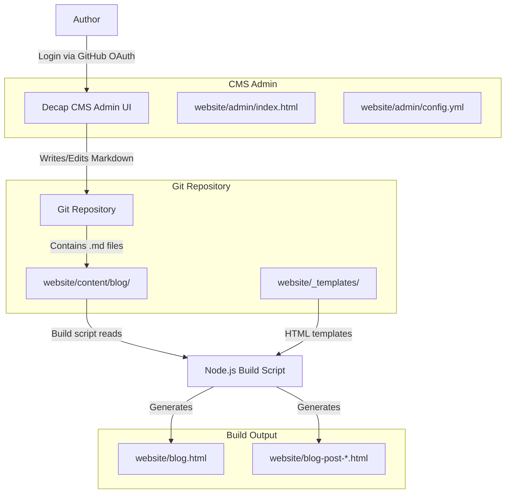
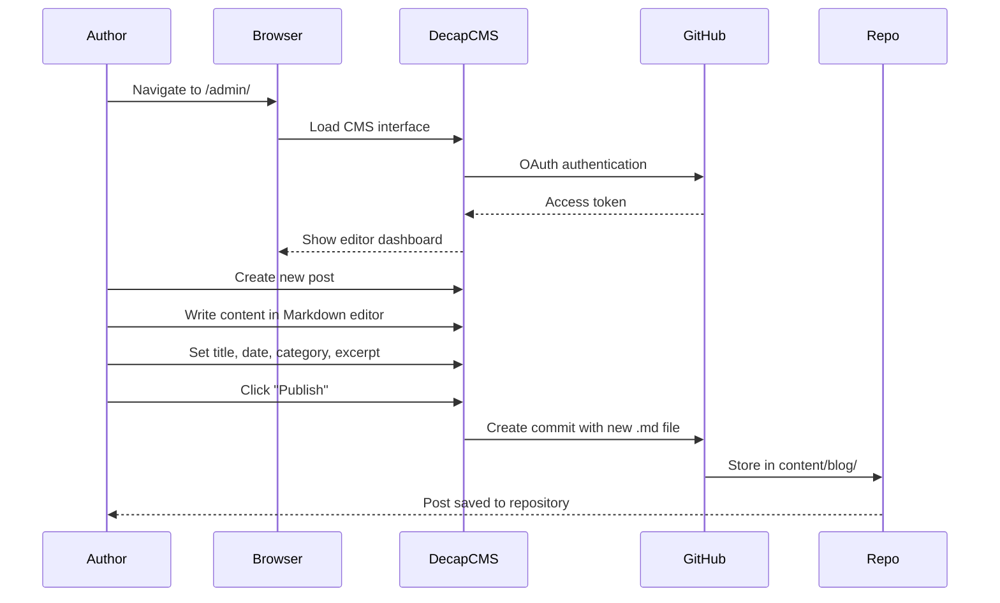
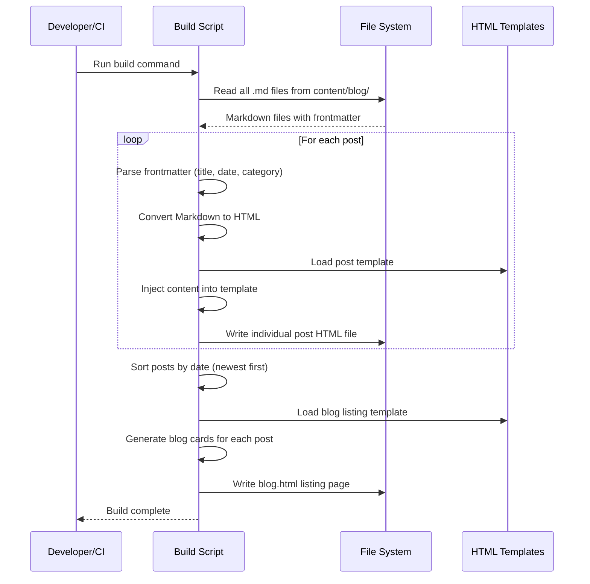

# Design Document: Blog CMS Integration

## Overview

This feature integrates Decap CMS (formerly Netlify CMS) into The Solution Architect's static website to provide a browser-based editorial interface for writing and publishing blog posts. Instead of manually editing HTML files, the author will log in via GitHub OAuth, write posts in a rich Markdown editor, and commit them directly to the Git repository.

A lightweight Node.js build script will convert Markdown posts (stored in `website/content/blog/`) into fully-rendered HTML pages that match the existing site design. The build produces both individual post pages and an updated blog listing page, maintaining the current look and feel without requiring any runtime server.

The solution preserves the site's static nature — no databases, no server-side rendering at request time — while adding a professional content management workflow.

## Architecture



## Sequence Diagrams

### Writing and Publishing a Post



### Build Process



## Components and Interfaces

### Component 1: Decap CMS Admin Panel

**Purpose**: Provides the browser-based editorial interface for creating and editing blog posts.

**Files**:
- `website/admin/index.html` — CMS entry point
- `website/admin/config.yml` — CMS configuration (collections, fields, backend)

**Responsibilities**:
- Authenticate the author via GitHub OAuth
- Present a rich Markdown editor with live preview
- Define the content schema (title, date, category, body, etc.)
- Commit new/edited Markdown files directly to the Git repository

### Component 2: Content Store (Markdown Files)

**Purpose**: Stores blog post content as Markdown files with YAML frontmatter in the Git repository.

**Location**: `website/content/blog/`

**Responsibilities**:
- Store post metadata (title, date, category, excerpt, author) in YAML frontmatter
- Store post body as Markdown
- Use filename convention: `YYYY-MM-DD-slug.md`

### Component 3: Build Script

**Purpose**: Converts Markdown content into static HTML pages matching the existing site design.

**Interface**:
```javascript
// build-blog.js - Main build script entry point

/**
 * Reads all Markdown posts, converts to HTML, and writes output files.
 * @returns {Promise<BuildResult>}
 */
async function buildBlog() { /* ... */ }

/**
 * Parses a single Markdown file into structured post data.
 * @param {string} filePath - Path to the .md file
 * @returns {Post}
 */
function parsePost(filePath) { /* ... */ }

/**
 * Renders a single post into a full HTML page.
 * @param {Post} post - Parsed post data
 * @param {string} template - HTML template string
 * @returns {string} - Complete HTML page
 */
function renderPost(post, template) { /* ... */ }

/**
 * Generates the blog listing page with cards for all posts.
 * @param {Post[]} posts - All posts sorted by date
 * @param {string} template - Blog listing HTML template
 * @returns {string} - Complete blog.html content
 */
function renderListing(posts, template) { /* ... */ }
```

**Responsibilities**:
- Read and parse Markdown files with frontmatter
- Convert Markdown body to HTML
- Inject content into HTML templates
- Generate individual post pages
- Generate the blog listing page
- Calculate reading time from word count

### Component 4: HTML Templates

**Purpose**: Provide the HTML structure that wraps blog content, maintaining consistency with the existing site design.

**Location**: `website/_templates/`

**Files**:
- `post.html` — Template for individual blog post pages
- `blog-listing.html` — Template for the blog index page

**Responsibilities**:
- Define placeholder tokens for dynamic content (e.g., `{{title}}`, `{{content}}`, `{{date}}`)
- Include the existing header, footer, navigation, and CSS references
- Maintain accessibility features (skip links, ARIA roles, semantic HTML)

## Data Models

### Post Frontmatter Schema

```yaml
---
title: "Post Title Here"
date: 2025-01-15
category: "Architecture"
excerpt: "A brief summary of the post for the listing page."
author: "The Solution Architect"
readingTime: 5
---
```

### Post Object (Internal)

```javascript
/**
 * @typedef {Object} Post
 * @property {string} title - Post title
 * @property {Date} date - Publication date
 * @property {string} category - Post category (Architecture, Government, Delivery, etc.)
 * @property {string} excerpt - Short summary for listing cards
 * @property {string} author - Author name
 * @property {number} readingTime - Estimated reading time in minutes
 * @property {string} slug - URL-friendly identifier derived from filename
 * @property {string} body - Raw Markdown body content
 * @property {string} htmlContent - Converted HTML body content
 */
```

### Decap CMS Config Schema

```yaml
backend:
  name: github
  repo: "owner/repo-name"
  branch: main

media_folder: "website/images/blog"
public_folder: "/images/blog"

collections:
  - name: "blog"
    label: "Blog Posts"
    folder: "website/content/blog"
    create: true
    slug: "{{year}}-{{month}}-{{day}}-{{slug}}"
    fields:
      - { label: "Title", name: "title", widget: "string" }
      - { label: "Publish Date", name: "date", widget: "datetime" }
      - { label: "Category", name: "category", widget: "select", 
          options: ["Architecture", "Government", "Delivery", "Practice", "Cloud", "Governance"] }
      - { label: "Excerpt", name: "excerpt", widget: "text" }
      - { label: "Author", name: "author", widget: "string", default: "The Solution Architect" }
      - { label: "Body", name: "body", widget: "markdown" }
```

**Validation Rules**:
- `title` is required, non-empty string
- `date` is required, valid ISO date
- `category` must be one of the predefined options
- `excerpt` is required, max 200 characters recommended
- `slug` is auto-generated from date and title

## Algorithmic Pseudocode

### Main Build Algorithm

```pascal
ALGORITHM buildBlog
INPUT: contentDir (path to Markdown files), templateDir (path to templates), outputDir (path for HTML output)
OUTPUT: Generated HTML files written to outputDir

BEGIN
  // Step 1: Load templates
  postTemplate ← readFile(templateDir + "/post.html")
  listingTemplate ← readFile(templateDir + "/blog-listing.html")
  
  // Step 2: Discover and parse all posts
  markdownFiles ← findFiles(contentDir, "*.md")
  posts ← EMPTY LIST
  
  FOR EACH file IN markdownFiles DO
    post ← parsePost(file)
    IF post IS VALID THEN
      posts.ADD(post)
    ELSE
      LOG WARNING "Skipping invalid post: " + file
    END IF
  END FOR
  
  // Step 3: Sort posts by date (newest first)
  SORT posts BY date DESCENDING
  
  // Step 4: Generate individual post pages
  FOR EACH post IN posts DO
    html ← renderPost(post, postTemplate)
    slug ← post.slug
    writeFile(outputDir + "/" + slug + ".html", html)
  END FOR
  
  // Step 5: Generate blog listing page
  listingHtml ← renderListing(posts, listingTemplate)
  writeFile(outputDir + "/blog.html", listingHtml)
  
  RETURN BuildResult(postsGenerated: posts.LENGTH, success: TRUE)
END
```

**Preconditions:**
- `contentDir` exists and is readable
- `templateDir` contains valid `post.html` and `blog-listing.html` templates
- `outputDir` exists and is writable

**Postconditions:**
- One HTML file exists for each valid Markdown post
- `blog.html` contains cards for all posts in reverse chronological order
- All generated HTML matches the existing site's structure and styling

### Parse Post Algorithm

```pascal
ALGORITHM parsePost
INPUT: filePath (path to a Markdown file)
OUTPUT: Post object with parsed frontmatter and HTML content

BEGIN
  rawContent ← readFile(filePath)
  
  // Step 1: Extract frontmatter (between --- delimiters)
  IF rawContent DOES NOT START WITH "---" THEN
    RETURN INVALID
  END IF
  
  frontmatterEnd ← findSecondOccurrence(rawContent, "---")
  frontmatterYaml ← rawContent[3..frontmatterEnd]
  markdownBody ← rawContent[frontmatterEnd + 3..END]
  
  // Step 2: Parse YAML frontmatter
  metadata ← parseYaml(frontmatterYaml)
  
  // Step 3: Validate required fields
  IF metadata.title IS EMPTY OR metadata.date IS EMPTY THEN
    RETURN INVALID
  END IF
  
  // Step 4: Convert Markdown to HTML
  htmlContent ← markdownToHtml(markdownBody)
  
  // Step 5: Calculate reading time
  wordCount ← countWords(markdownBody)
  readingTime ← CEILING(wordCount / 200)
  
  // Step 6: Derive slug from filename
  slug ← extractSlug(filePath)
  
  RETURN Post(
    title: metadata.title,
    date: metadata.date,
    category: metadata.category OR "Uncategorised",
    excerpt: metadata.excerpt OR firstParagraph(markdownBody),
    author: metadata.author OR "The Solution Architect",
    readingTime: readingTime,
    slug: slug,
    body: markdownBody,
    htmlContent: htmlContent
  )
END
```

**Preconditions:**
- `filePath` points to an existing, readable file
- File contains valid YAML frontmatter between `---` delimiters

**Postconditions:**
- Returns a valid Post object if frontmatter is well-formed
- Returns INVALID if required fields are missing
- `htmlContent` is safe, sanitised HTML
- `readingTime` is at least 1 minute

### Template Rendering Algorithm

```pascal
ALGORITHM renderPost
INPUT: post (Post object), template (HTML template string)
OUTPUT: Complete HTML page as string

BEGIN
  html ← template
  
  // Replace all template tokens with post data
  html ← REPLACE(html, "{{title}}", escapeHtml(post.title))
  html ← REPLACE(html, "{{date}}", formatDate(post.date, "D MMMM YYYY"))
  html ← REPLACE(html, "{{dateISO}}", formatDate(post.date, "YYYY-MM-DD"))
  html ← REPLACE(html, "{{category}}", escapeHtml(post.category))
  html ← REPLACE(html, "{{author}}", escapeHtml(post.author))
  html ← REPLACE(html, "{{readingTime}}", post.readingTime + " min read")
  html ← REPLACE(html, "{{content}}", post.htmlContent)
  html ← REPLACE(html, "{{excerpt}}", escapeHtml(post.excerpt))
  html ← REPLACE(html, "{{slug}}", post.slug)
  
  RETURN html
END
```

**Preconditions:**
- `post` contains all required fields
- `template` contains valid HTML with `{{token}}` placeholders

**Postconditions:**
- All `{{token}}` placeholders are replaced
- Text fields are HTML-escaped to prevent XSS
- `htmlContent` (already HTML) is inserted without double-escaping
- Output is valid HTML

## Key Functions with Formal Specifications

### Function: buildBlog()

```javascript
async function buildBlog()
```

**Preconditions:**
- `website/content/blog/` directory exists
- `website/_templates/post.html` and `blog-listing.html` exist
- Node.js dependencies (marked, gray-matter) are installed

**Postconditions:**
- Returns `{ postsGenerated: number, success: boolean }`
- All valid `.md` files produce corresponding `.html` files
- `blog.html` is regenerated with all posts listed
- Invalid posts are skipped with warnings logged

### Function: parsePost(filePath)

```javascript
function parsePost(filePath)
```

**Preconditions:**
- `filePath` is a string pointing to an existing `.md` file
- File is UTF-8 encoded

**Postconditions:**
- Returns a `Post` object if valid, or `null` if invalid
- `post.readingTime >= 1`
- `post.slug` matches the filename pattern (without date prefix and extension)
- `post.htmlContent` contains no raw Markdown syntax

### Function: renderPost(post, template)

```javascript
function renderPost(post, template)
```

**Preconditions:**
- `post` is a valid Post object (non-null, all required fields present)
- `template` is a non-empty string containing `{{content}}` placeholder

**Postconditions:**
- Returns a complete HTML string
- No `{{...}}` placeholders remain in output
- HTML is well-formed and matches existing site structure

### Function: renderListing(posts, template)

```javascript
function renderListing(posts, template)
```

**Preconditions:**
- `posts` is an array (may be empty) sorted by date descending
- `template` contains `{{posts}}` placeholder

**Postconditions:**
- Returns complete HTML for blog.html
- Each post generates one blog card in the listing
- Posts appear in reverse chronological order
- Empty posts array produces a "No posts yet" message

## Example Usage

```javascript
// Build script usage (run from project root)
// $ node website/build-blog.js

const { buildBlog } = require('./website/build-blog');

async function main() {
  const result = await buildBlog();
  console.log(`Built ${result.postsGenerated} blog posts.`);
}

main().catch(console.error);
```

```yaml
# Example Markdown post: website/content/blog/2025-01-15-architecture-decisions.md
---
title: "Why Architecture Decisions Are Not Technical Problems"
date: 2025-01-15
category: "Architecture"
excerpt: "The biggest mistake new architects make is treating every decision as a technical one."
author: "The Solution Architect"
---

The biggest mistake new architects make is treating every decision as a technical one...

## The Decision That Looks Technical But Isn't

Here's a scenario I've seen play out dozens of times...
```

```html
<!-- Decap CMS admin page: website/admin/index.html -->
<!DOCTYPE html>
<html>
<head>
  <meta charset="utf-8" />
  <meta name="viewport" content="width=device-width, initial-scale=1.0" />
  <title>Content Manager — The Solution Architect</title>
  <script src="https://unpkg.com/decap-cms@^3.0.0/dist/decap-cms.js"></script>
</head>
<body>
</body>
</html>
```

## Correctness Properties

*A property is a characteristic or behavior that should hold true across all valid executions of a system — essentially, a formal statement about what the system should do. Properties serve as the bridge between human-readable specifications and machine-verifiable correctness guarantees.*

### Property 1: Completeness

*For any* set of Markdown files in the Content_Directory, the Build_Script SHALL produce exactly one HTML file for each valid file, include all valid posts in the Listing_Page, and skip invalid files with a logged warning.

**Validates: Requirements 7.1, 7.2, 7.3**

### Property 2: Ordering

*For any* list of posts with dates, the Listing_Page SHALL display them in descending date order, and for any two adjacent posts the first post's date is greater than or equal to the second's. The ordering SHALL be stable across repeated builds.

**Validates: Requirements 6.1, 6.4**

### Property 3: Idempotency

*For any* set of Markdown files, running the Build_Script twice with no content changes SHALL produce byte-identical output files.

**Validates: Requirements 7.4**

### Property 4: Template Integrity

*For any* valid Post, the rendered Post_Page SHALL contain the site header with navigation, footer, and references to `css/style.css` and `js/main.js`.

**Validates: Requirements 5.5**

### Property 5: Content Fidelity

*For any* Markdown body containing headings, lists, links, code blocks, or blockquotes, the Build_Script's HTML conversion SHALL produce corresponding HTML elements without loss or corruption.

**Validates: Requirements 4.1**

### Property 6: Slug Uniqueness

*For any* set of Markdown files, each valid file SHALL map to a distinct output HTML filename derived from its slug. If two files produce the same slug, only the newer post is kept.

**Validates: Requirements 8.1, 8.2, 8.3**

### Property 7: Safe Output

*For any* string containing HTML special characters (`<`, `>`, `&`, `"`) used as a title, excerpt, category, or author, the rendered output SHALL contain only the escaped equivalents. Additionally, *for any* Markdown content containing script tags or event handlers, the HTML output SHALL have those dangerous constructs stripped.

**Validates: Requirements 5.3, 10.1, 4.2, 10.2**

### Property 8: Reading Time Accuracy

*For any* Markdown body, the Reading_Time SHALL equal `ceil(wordCount / 200)` and SHALL always be at least 1 minute.

**Validates: Requirements 4.3, 4.4**

### Property 9: Frontmatter Round-Trip

*For any* valid Post object, serializing its metadata to YAML frontmatter and then parsing it back with the Build_Script SHALL produce an equivalent Post object with identical field values.

**Validates: Requirements 3.1, 3.2**

### Property 10: Placeholder Elimination

*For any* valid Post and template containing `{{...}}` placeholder tokens, the rendered output SHALL contain no remaining `{{...}}` tokens.

**Validates: Requirements 5.1, 5.2**

### Property 11: Default Field Values

*For any* valid Markdown file where the category, author, or excerpt fields are absent from frontmatter, the Build_Script SHALL assign the correct default values: "Uncategorised" for category, "The Solution Architect" for author, and the first paragraph of the body for excerpt.

**Validates: Requirements 3.5, 3.6, 3.7**

## Error Handling

### Error Scenario 1: Invalid Frontmatter

**Condition**: A Markdown file has missing or malformed YAML frontmatter (e.g., missing `title` or `date`).
**Response**: The build script logs a warning identifying the file and skips it. Other posts are still built.
**Recovery**: Author fixes the frontmatter via the CMS or directly in the file.

### Error Scenario 2: Template File Missing

**Condition**: The `_templates/post.html` or `_templates/blog-listing.html` file is missing or unreadable.
**Response**: The build script exits with a clear error message indicating which template is missing.
**Recovery**: Restore the template file from version control.

### Error Scenario 3: Empty Content Directory

**Condition**: No `.md` files exist in `content/blog/`.
**Response**: The build script generates `blog.html` with a "No posts yet" placeholder message. No individual post files are generated.
**Recovery**: Author creates a post via the CMS.

### Error Scenario 4: GitHub OAuth Failure

**Condition**: Author cannot authenticate with GitHub when accessing `/admin/`.
**Response**: Decap CMS displays its built-in authentication error. The site itself remains unaffected.
**Recovery**: Author verifies GitHub OAuth app configuration and tries again.

### Error Scenario 5: Duplicate Slugs

**Condition**: Two Markdown files would produce the same output filename.
**Response**: The build script logs an error identifying both files and skips the duplicate (keeps the newer post).
**Recovery**: Author renames one of the conflicting posts.

## Testing Strategy

### Unit Testing Approach

- Test `parsePost()` with valid Markdown files, missing frontmatter, empty files, and edge cases
- Test `renderPost()` with various post data and verify placeholder replacement
- Test `renderListing()` with 0, 1, and many posts
- Test reading time calculation with various word counts
- Test slug extraction from different filename formats

### Property-Based Testing Approach

**Property Test Library**: fast-check

- **Roundtrip property**: Any valid frontmatter object serialised to YAML and parsed back should equal the original
- **Ordering property**: For any list of posts with distinct dates, the output listing always has posts in descending date order
- **Escape property**: For any string containing HTML special characters used as a title, the output never contains unescaped `<`, `>`, `&`, or `"`
- **Reading time property**: For any non-empty string, reading time is always >= 1

### Integration Testing Approach

- End-to-end test: Place sample `.md` files in content directory, run build, verify output HTML files exist and contain expected content
- Verify generated HTML passes W3C validation
- Verify generated pages match the structure of the existing `blog-post-1.html`

## Performance Considerations

- The build script processes files sequentially — acceptable for a personal blog (likely < 100 posts)
- Markdown parsing and HTML generation are CPU-bound but fast for typical post sizes (< 5000 words)
- No incremental build needed initially; full rebuild is fast enough for the expected content volume
- If the blog grows significantly (500+ posts), consider adding incremental builds based on file modification timestamps

## Security Considerations

- **Authentication**: Decap CMS uses GitHub OAuth — only users with write access to the repository can publish
- **XSS Prevention**: All user-provided text (title, excerpt, category) is HTML-escaped before insertion into templates
- **Content Security**: Markdown-to-HTML conversion should use a sanitiser to strip dangerous HTML (script tags, event handlers)
- **Admin Access**: The `/admin/` path is publicly accessible but requires GitHub authentication to function — no sensitive data is exposed without login
- **Dependencies**: Pin versions of `marked` and `gray-matter` to avoid supply chain attacks; use `decap-cms` from a pinned CDN version

## Dependencies

| Dependency | Purpose | Type |
|---|---|---|
| `gray-matter` | Parse YAML frontmatter from Markdown files | Build (npm) |
| `marked` | Convert Markdown to HTML | Build (npm) |
| `decap-cms` | Browser-based CMS interface | CDN (client-side) |
| GitHub OAuth App | Authentication for CMS admin | External service |

**No runtime server dependencies** — the site remains fully static after build.
